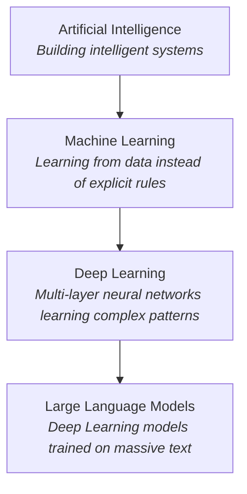

# Artificial Intelligence

## Introduction

Artificial Intelligence (AI) is one of the most influential fields in modern computer science. It powers virtual assistants, recommendation systems, search engines, autonomous vehicles, and modern conversational AI assistants.

But what exactly is Artificial Intelligence?

To answer that question, we must first understand what **intelligence** means.

Intelligence is the ability to learn from experience, reason about problems, adapt to new situations, and make decisions to achieve specific goals. Humans demonstrate intelligence through learning, problem-solving, communication, creativity, and applying knowledge in unfamiliar situations.

Artificial Intelligence is the branch of computer science that aims to build systems capable of performing tasks that normally require human intelligence. Unlike traditional software that follows explicitly programmed rules, many modern AI systems learn from data, recognize patterns, make predictions, and improve their performance over time.

It is important to understand that Artificial Intelligence is **not a single technology**. Instead, it is a broad field that includes many different techniques and disciplines such as Machine Learning, Deep Learning, Natural Language Processing, Computer Vision, Robotics, and Reinforcement Learning.

Throughout this curriculum, you will gradually learn how these disciplines fit together, why they work, and how modern AI systems are designed and built.

---

## Core Concepts

### Defining Artificial Intelligence

There is no single universally accepted definition of Artificial Intelligence. Different researchers have approached AI from different perspectives.

In 1956, **John McCarthy**, who coined the term *Artificial Intelligence*, described it as:

> "The science and engineering of making intelligent machines."

Another widely accepted definition comes from **Russell and Norvig**, who describe AI as the study of intelligent agents: systems that perceive their environment and take actions to maximize the chances of achieving their goals.

Although the wording differs, the objective remains the same: building machines capable of performing tasks that would normally require human intelligence.

---

### A Brief History of AI

The field of Artificial Intelligence has evolved through several important stages.

* **1950s**: Early research began with the idea that machines could simulate human reasoning.
* **1956**: The Dartmouth Conference officially established Artificial Intelligence as a research field.
* **1960s-1970s**: Researchers focused on symbolic AI and rule-based systems.
* **Mid-1970s**: Funding cuts and unmet expectations led to the first AI Winter.
* **1980s**: Expert systems became commercially successful.
* **Late 1980s-1990s**: Progress slowed again, causing a second AI Winter.
* **1990s-2010s**: Machine Learning shifted AI toward learning from data instead of relying on manually written rules.
* **2012 onwards**: Deep Learning revolutionized fields such as computer vision and speech recognition.
* **2022 onwards**: Large Language Models and Foundation Models transformed how people interact with AI.
* **Today**: AI systems increasingly combine reasoning, retrieval, memory, and tools to create autonomous AI agents.

---

### Major Branches of AI

Artificial Intelligence is a broad discipline consisting of several specialized areas.

* **Machine Learning** focuses on enabling computers to learn from data.
* **Natural Language Processing (NLP)** enables computers to understand and generate human language.
* **Computer Vision** allows machines to interpret images and videos.
* **Robotics** combines AI with physical systems capable of interacting with the real world.
* **Knowledge Representation and Reasoning** focuses on representing facts and drawing logical conclusions.
* **Search and Planning** develops algorithms that help machines make decisions and solve complex problems.
* **Reinforcement Learning** teaches agents to make decisions through trial and error using rewards and penalties.

Each of these fields addresses different problems, but together they contribute to the broader goal of creating intelligent systems.

---

### AI vs Machine Learning vs Deep Learning vs Large Language Models

One of the most common misconceptions is treating AI, Machine Learning, and Deep Learning as interchangeable terms. They are not.

Their relationship is a nested hierarchy: each level is a specialized subset of the one above:

Understanding this hierarchy is essential because the rest of this curriculum focuses primarily on these increasingly specialized areas.

---

### Capabilities and Limitations

Modern AI systems can:

* Translate languages.
* Recognize objects in images.
* Generate text, code, and images.
* Recommend products and content.
* Assist in scientific research.
* Play complex games at superhuman levels.

Despite these impressive capabilities, modern AI systems may:

* Generate incorrect or fabricated information (hallucinations).
* Reflect biases present in training data.
* Require enormous amounts of data and computational resources.
* Struggle with common-sense reasoning.
* Perform poorly outside the situations they were trained for.

Understanding both the strengths and weaknesses of AI is essential for using it responsibly and effectively.

---

## Why It Matters

Artificial Intelligence is no longer limited to research laboratories or science fiction. It has become a general-purpose technology reshaping nearly every industry.

Healthcare uses AI to assist in medical diagnosis and drug discovery. Financial institutions use it to detect fraud and assess risk. Manufacturers use AI to automate quality inspection and predictive maintenance. Online platforms rely on AI to recommend products, movies, music, and news. Software engineers increasingly use AI assistants to generate code, explain bugs, and improve productivity.

Understanding AI is becoming an essential skill for computer scientists and software engineers. Whether you plan to build intelligent systems or simply use AI effectively, understanding its foundations will help you make better technical decisions and evaluate AI technologies critically.

---

## Real-World Examples

You already interact with Artificial Intelligence more often than you might realize.

* Conversational assistants answering questions and generating text.
* Translation services converting between languages in real time.
* Streaming platforms recommending movies and music.
* Self-driving vehicles detecting roads, pedestrians, and traffic signs.
* Email spam filters automatically identifying unwanted messages.
* Medical imaging systems assisting doctors in detecting diseases.

These applications demonstrate that AI is not a single product but a collection of technologies solving different kinds of problems.

---

## How It's Built

This topic is a map, not a manual. Every concept introduced here is *built* later in this curriculum:

* The learning systems described here are implemented from scratch in **Part 2: Building AI**.
* The neural networks behind Deep Learning are constructed layer by layer in **Part 3**.
* Large Language Models and the agents built on top of them are engineered in **Parts 4 and 5**.

By the end of the track, nothing in this topic will feel like magic: you will have built a working version of each idea.

---

## Key Takeaways

* Artificial Intelligence aims to build systems capable of performing tasks that typically require human intelligence.
* AI is a broad discipline that includes several specialized fields.
* AI ⊃ Machine Learning ⊃ Deep Learning ⊃ Large Language Models.
* Modern AI became possible through advances in algorithms, data, and computing power.
* AI is transforming many industries but still has important limitations.

---

## References

### Primary

* *Artificial Intelligence: A Modern Approach (4th Edition)*, Stuart Russell & Peter Norvig
  https://aima.cs.berkeley.edu/

### Supplementary

* *The Master Algorithm*, Pedro Domingos
* *Life 3.0*, Max Tegmark

### Articles

* IBM: What is Artificial Intelligence?
  https://www.ibm.com/think/topics/artificial-intelligence

* Encyclopaedia Britannica: Artificial Intelligence
  https://www.britannica.com/technology/artificial-intelligence

---

## Think About It

1. Can a machine be intelligent without being conscious?
2. Is today's AI truly intelligent, or is it primarily advanced pattern recognition?
3. Which branch of Artificial Intelligence do you think will have the greatest impact over the next decade?
4. What kinds of problems should AI never be allowed to solve?

---

## Next Topic

AI is the field, but modern AI works because of one idea: systems that **learn from data** instead of following hand-written rules.

**Next → [Topic 02: Machine Learning](topic-02-machine-learning.md)**
