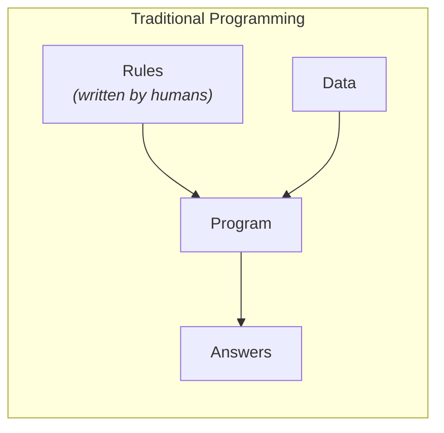
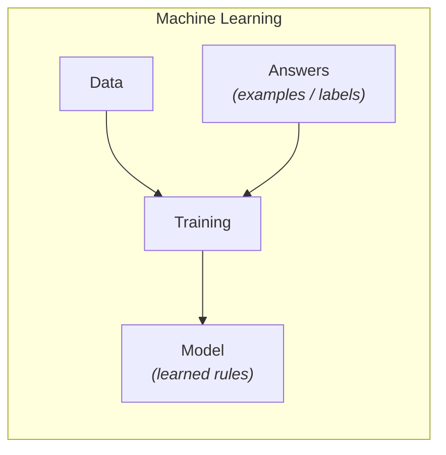

# Machine Learning

## Introduction

In the previous topic, we saw that Artificial Intelligence is a broad field with many branches. Among all of them, one branch is responsible for nearly every AI success story of the last two decades: **Machine Learning (ML)**.

Machine Learning is the discipline of building systems that **learn from data** instead of being explicitly programmed with rules.

The idea dates back to 1959, when **Arthur Samuel** described Machine Learning as:

> "The field of study that gives computers the ability to learn without being explicitly programmed."

A more precise and widely used definition comes from **Tom Mitchell** (1997):

> "A computer program is said to learn from experience *E* with respect to some task *T* and some performance measure *P*, if its performance on *T*, as measured by *P*, improves with experience *E*."

In plain terms: a system is *learning* if it gets better at a task the more data it sees.

This single idea — improvement through experience rather than instruction — is the foundation of modern AI. Deep Learning, Large Language Models, and AI agents are all Machine Learning at their core.

---

## Why It Matters

To understand why Machine Learning exists, consider a problem that defeated traditional programming: **spam filtering**.

You could try writing explicit rules: flag emails containing "free money," flag unknown senders, flag excessive capital letters. But spammers adapt — they write "fr€€ m0ney," use hijacked accounts, and mimic legitimate emails. Every new trick requires a new hand-written rule, and the rule list grows endlessly while always staying one step behind.

Machine Learning inverts the approach: instead of writing rules, you show the system thousands of examples of spam and non-spam, and it **discovers the distinguishing patterns itself**. When spammers adapt, you retrain on new examples — no rule rewriting required.

This is why ML dominates wherever the rules are too complex, too numerous, or too fluid to write by hand: recognizing faces, understanding speech, translating languages, predicting demand, generating text. Nobody can write down explicit rules for "what makes this photo a cat" — but a system can learn them from a million labeled photos.

---

## Core Concepts

### The Paradigm Inversion

The clearest way to understand Machine Learning is to contrast it with traditional programming.

In traditional programming, a human writes the rules. The program applies those rules to input data and produces answers:

In Machine Learning, the flow is inverted. We provide the data **and the answers** (examples), and the system produces the rules:

The learned rules are called a **model**. Once trained, the model is used like a traditional program: feed it new data, get answers out. The difference is that no human ever wrote its internal logic — it was discovered from examples.

---

### Data, Datasets, and Features

A collection of examples used for learning is called a **dataset**. Each example is described by **features** — the individual pieces of information the model can use. For a house, features might be its size, location, age, and number of bedrooms. In many datasets, each example also includes the correct answer, called a **label** (the house's actual selling price).

Data is the foundation of Machine Learning: a model can only learn from the examples it is given. If the data is incomplete, biased, or unrepresentative, the model learns those flaws too. In practice, improving the data often matters more than improving the model — hence the practitioner's saying: *"Better data beats more complex algorithms."*

---

### What "Learning" Actually Means

The word *learning* sounds mysterious, but mechanically it is quite concrete.

A **model** is a mathematical function with adjustable internal settings called **parameters**. Before training, these parameters are essentially random, and the model's predictions are useless.

**Training** is the process of repeatedly:

1. Showing the model an example.
2. Comparing the model's prediction to the correct answer.
3. Measuring how wrong it was (the **error**).
4. Adjusting the parameters slightly to reduce that error.

Repeat this millions of times, and the parameters gradually settle into values that make good predictions. That is all "learning" means: **automatically adjusting parameters to reduce error on examples**.

How exactly the adjustment happens (gradient descent) is covered later in this chapter — for now, the key insight is that learning is an optimization process, not magic.

A useful mental model: Machine Learning is a **search for the best function** that maps inputs to outputs. Training is the search, the model is the function that gets discovered, and using that function on new data is called **inference** — a distinction (training vs inference) that gets its own topic later in this chapter.

One caution: despite the name, this "learning" is numerical adjustment, not human-style understanding. The model forms no concepts or intentions — a point the final topic of this chapter returns to.

---

### Generalization: The Real Goal

A common misconception is that a model's job is to get the training examples right. It is not.

The true goal is **generalization** — performing well on **new, unseen data**. A spam filter that perfectly classifies the 10,000 emails it was trained on but fails on tomorrow's inbox is worthless.

This creates the central tension of Machine Learning:

* A model that merely **memorizes** its training data fails on anything new (called **overfitting**).
* A model that is too simple to capture the real patterns fails everywhere (called **underfitting**).

Almost everything in ML practice — how much data to collect, how complex a model to use, how to evaluate it — revolves around managing this tension. It is such a central discipline that this chapter dedicates an entire topic to evaluation.

---

### When to Use Machine Learning (and When Not To)

Machine Learning is powerful but not universal. A useful rule of thumb:

**Use traditional programming when:**

* The rules are known, exact, and stable (tax calculation, sorting, date formatting).
* Mistakes are unacceptable and behavior must be fully predictable.
* You have little or no data.

**Use Machine Learning when:**

* The rules are unknown or impossible to articulate (image recognition, language understanding).
* The rules constantly change (fraud patterns, user preferences).
* The problem involves prediction from patterns in large amounts of data.

Choosing ML when a hundred lines of ordinary code would suffice is one of the most common beginner mistakes. Data-driven learning is a tool — not an upgrade over regular programming.

---

### The Three Ingredients

Every Machine Learning system, regardless of complexity, is built from three essential ingredients:

* **Data** — the examples from which the system learns.
* **Model** — the mathematical function whose parameters are being learned.
* **Learning algorithm** — the procedure that adjusts those parameters to improve performance.

Whether it is a simple linear regression or a trillion-parameter Large Language Model, these three ingredients never change. Only their scale and sophistication do.

---

### Where ML Sits in the Hierarchy

Recall the nested hierarchy from the previous topic: **AI ⊃ ML ⊃ Deep Learning ⊃ LLMs**.

Machine Learning is the layer where "learning from data" enters the picture. Everything below it — Deep Learning, Large Language Models — is still Machine Learning, just with increasingly powerful model types. When you later study transformers and LLMs, remember: they are trained with exactly the loop described above — predict, measure error, adjust parameters, repeat.

---

## Real-World Examples

* **Spam filtering** — learns spam patterns from millions of labeled emails.
* **House price estimation** — learns the relationship between features (size, location, age) and price from historical sales.
* **Credit card fraud detection** — learns normal spending patterns and flags anomalies in real time.
* **Product recommendations** — learns your preferences from your behavior and that of similar users.
* **Medical diagnosis support** — learns to detect tumors from thousands of annotated scans.
* **Speech recognition** — learns the mapping from audio waves to text from vast recorded speech.

Notice the pattern in every example: no programmer wrote the decision logic. It was learned from data.

---

## How It's Built

This topic explains *what* learning is; the rest of the track makes it concrete:

* The measurement of error and the adjustment mechanism (**gradient descent**) appear later in this chapter as intuition, and are derived properly in the math chapters (**Chapters 2–6**).
* Classical ML models — linear regression, decision trees, and friends — are studied in **Chapter 7** and implemented from scratch in **Part 2 — Building AI**.
* The same learning loop, scaled up to billions of parameters, becomes Deep Learning (**Part 3**) and Large Language Models (**Part 4**).

The training loop you just read in four bullet points is, genuinely, the same loop that trains frontier AI models. Only the scale changes.

---

## Key Takeaways

* Machine Learning builds systems that learn from data instead of following hand-written rules.
* ML inverts traditional programming: data + answers → rules (the model), rather than rules + data → answers.
* Learning means automatically adjusting a model's parameters to reduce error on examples.
* The goal is generalization — performance on unseen data — not memorizing training data.
* Every ML system is data + model + learning algorithm — only the scale changes.
* ML is the right tool when rules are unknown, complex, or changing; traditional code is the right tool when rules are exact and stable.

---

## References

### Primary

* *The Hundred-Page Machine Learning Book* — Andriy Burkov
  https://themlbook.com/

### Supplementary

* *Hands-On Machine Learning with Scikit-Learn, Keras & TensorFlow (3rd Edition)* — Aurélien Géron
* *Machine Learning* — Tom M. Mitchell (source of the classic learning definition)

### Articles

* Google — Introduction to Machine Learning
  https://developers.google.com/machine-learning/intro-to-ml

* IBM — What is Machine Learning?
  https://www.ibm.com/think/topics/machine-learning

---

## Think About It

1. Why is it impossible to write explicit rules for recognizing a cat in a photo, when a child learns it effortlessly from a few examples?
2. If a model scores 100% on its training data, why might that be bad news rather than good news?
3. Think of a problem in your daily life: would you solve it with hand-written rules or with learning from data? Why?
4. Samuel's definition says "without being explicitly programmed" — but humans still choose the data, the model type, and the goal. Is ML really free of human programming?

---

## Next Topic

Machines learn from data — but *data comes in different forms*. Sometimes it includes correct answers, sometimes it doesn't, and sometimes the only feedback is reward or punishment. These three situations define the three great **learning paradigms**.

**Next → [Topic 03: Learning Paradigms](topic-03-learning-paradigms.md)**
