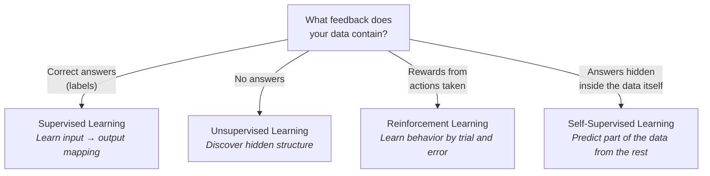

# Learning Paradigms

## Introduction

The previous topic ended with a question: machines learn from data, but *what kind of feedback* does that data contain?

The answer defines the three great **learning paradigms** of Machine Learning:

* **Supervised Learning**: learning from examples that include the correct answers.
* **Unsupervised Learning**: learning from examples with no answers, by discovering hidden structure.
* **Reinforcement Learning**: learning from trial and error, guided only by rewards and penalties.

To these three classics, modern AI has added a powerful twist called **Self-Supervised Learning**, in which the data generates its own answers. It is the reason Large Language Models exist.

Almost every ML system you will ever encounter belongs to one of these paradigms, so recognizing them is one of the most useful classification skills in the entire field.

---

## Core Concepts

### The Deciding Question: What Feedback Do You Have?

### At a Glance

| Paradigm | Answers come from | Goal | Typical example |
|----------|-------------------|------|-----------------|
| Supervised | Human-provided labels | Predict outputs | Spam detection |
| Unsupervised | Nobody (no labels) | Discover structure | Customer segmentation |
| Reinforcement | The environment (rewards) | Learn behavior | Game-playing agents |
| Self-supervised | The data itself | Learn representations | LLM pretraining |

---

### Supervised Learning

The workhorse of Machine Learning. The dataset contains input features **and** the correct output (the label), and the model learns the mapping between them.

Supervised problems come in two flavors:

* **Classification**: the output is a category: spam / not spam, cat / dog, tumor / healthy.
* **Regression**: the output is a number: a house price, tomorrow's temperature, delivery time.

Its strength is precision; its weakness is cost. Every label was produced by a human (or an expensive measurement), which limits how large supervised datasets can grow.

Between the paradigms lies **semi-supervised learning**: a small labeled set combined with a much larger unlabeled pool, common wherever labels are expensive but raw data is abundant.

---

### Unsupervised Learning

No labels, only raw examples. The model's job is to find structure humans didn't annotate:

* **Clustering**: group similar examples together (customer segments, topic groups).
* **Dimensionality reduction**: compress many features into few while preserving meaning.
* **Anomaly detection**: flag examples that don't fit any pattern (fraud, machine faults).

Unsupervised learning answers a different question than supervised learning: not "what is the correct output?" but "*what is going on in this data?*"

A deeper purpose of unsupervised (and self-supervised) learning is **representation learning**: discovering internal representations of data that make later tasks much easier. You will meet these representations again as **embeddings** later in this chapter.

---

### Reinforcement Learning

Here there is no dataset at all when learning begins. An **agent** takes **actions** in an **environment** and receives **rewards** or penalties. Through trial and error (playing millions of games, attempting millions of steps) it learns a strategy (a **policy**) that maximizes reward over time.

Reinforcement learning shines where correct answers can't be labeled in advance but success can be measured: games, robotics, resource scheduling. It also plays a surprising role in modern LLMs: aligning them with human preferences (RLHF) is a reinforcement learning technique, covered later in this chapter. Note the division of labor there: pretraining gives an LLM its knowledge; reinforcement learning mainly shapes its behavior and preferences.

---

### Self-Supervised Learning: The Modern Twist

Self-supervised learning gets supervised-style training signal **without human labels**, by hiding part of the data and training the model to predict it:

* Hide the next word in a sentence → predict it.
* Mask a region of an image → reconstruct it.

The "label" is manufactured from the data itself, so *any* text or image becomes training data for free, which is exactly what the name means: the supervision comes from the data, not from humans. This is how Large Language Models are pretrained on trillions of words. No army of human labelers could ever annotate that much. Removing the labeling bottleneck is what made training on virtually all public text and images possible. When you reach the LLM topics later in this chapter, remember: their superpower starts here.

---

### Paradigms Combine

Real systems rarely use one paradigm in isolation. A modern chatbot (or any **foundation model**) stacks three: self-supervised pretraining on internet text, supervised fine-tuning on curated examples, and reinforcement learning from human feedback. Recognizing the layers is the first step to understanding how such systems are actually built.

---

### A Different Axis: Offline vs Online Learning

The paradigms describe *where feedback comes from*, not *when* learning happens. That is a separate axis: some systems are trained once on a fixed dataset (**offline learning**), while others continuously update as new data arrives (**online learning**). Any paradigm can run in either mode.

---

## Why It Matters

The paradigm is not a stylistic choice: it is dictated by **what feedback you have**, and it determines everything downstream: which algorithms you can use, how much human effort the data requires, and what kinds of problems you can solve.

Labeled data is expensive: someone has to manually tag millions of emails as spam, or outline tumors in thousands of scans. Unlabeled data is nearly free: the internet is full of it. And some problems, like teaching a robot to walk, have no dataset at all: the machine must generate its own experience.

Knowing the paradigms also helps you decode everyday AI jargon: each buzzword is really a paradigm in disguise:

* "Pretrained on the internet" → self-supervised learning.
* "Clusters similar users" → unsupervised learning.
* "Fine-tuned with human feedback" → supervised learning plus reinforcement learning.

And a single system like ChatGPT often uses several of them, one after another.

---

## Real-World Examples

* **Supervised**: spam filtering, medical image diagnosis, house price prediction, speech-to-text.
* **Unsupervised**: customer segmentation for marketing, grouping news articles by topic, detecting fraudulent transactions as anomalies.
* **Reinforcement**: AlphaGo defeating world champions, robots learning to walk, data-center cooling optimization.
* **Self-supervised**: GPT-style language models predicting the next word, image models learning from unlabeled photos.

---

## How It's Built

* Supervised and unsupervised algorithms are the substance of **Classical Machine Learning**, the very next topic, then studied deeply in **Chapter 7: Classical Machine Learning** and implemented from scratch in **Part 2: Building AI**.
* Self-supervised pretraining reappears when this chapter reaches **LLMs and Pretraining vs Fine-tuning**, and is engineered for real in **Part 4**.
* Reinforcement learning returns in this chapter's **Alignment (RLHF)** topic, with full treatment deferred to the optional robotics extension of the track.

---

## Key Takeaways

* The learning paradigm is dictated by the feedback available: labels → supervised, none → unsupervised, rewards → reinforcement, self-generated labels → self-supervised.
* Supervised learning splits into classification (categories) and regression (numbers).
* Unsupervised learning discovers structure: clusters, compressed representations, anomalies.
* Reinforcement learning learns behavior through trial, error, and reward, with no pre-existing dataset.
* Self-supervised learning manufactures labels from raw data, enabling internet-scale training, the foundation of LLMs.
* Modern systems like chatbots combine several paradigms in one pipeline.

---

## References

### Primary

* *The Hundred-Page Machine Learning Book*, Andriy Burkov (Chapters on supervised & unsupervised learning)
  https://themlbook.com/

### Supplementary

* *Hands-On Machine Learning with Scikit-Learn, Keras & TensorFlow (3rd Edition)*, Aurélien Géron
* *Reinforcement Learning: An Introduction (2nd Edition)*, Richard Sutton & Andrew Barto (free online)
  http://incompleteideas.net/book/the-book.html

### Articles

* Google: Supervised, Unsupervised & other ML paradigms (ML Crash Course)
  https://developers.google.com/machine-learning/intro-to-ml/what-is-ml

* IBM: Supervised vs Unsupervised Learning
  https://www.ibm.com/think/topics/supervised-vs-unsupervised-learning

---

## Think About It

1. Labeling data is expensive. For which of these could you get labels cheaply, and how: detecting broken products on an assembly line, predicting which customers will cancel, teaching a car to park?
2. Why can't supervised learning alone produce a system like ChatGPT?
3. A child learns language without anyone labeling grammatical sentences. Which paradigm does that most resemble, and where does the analogy break down?
4. Can you think of a problem where reward is the *only* possible feedback signal?

---

## Next Topic

You now know the *kinds* of learning. But paradigms are categories, not algorithms. The concrete methods that actually do the learning (linear regression, decision trees, k-means and their relatives) are the substance of **Classical Machine Learning**, and they still power most real-world ML today.

**Next → [Topic 04: Classical Machine Learning](topic-04-classical-machine-learning.md)**
