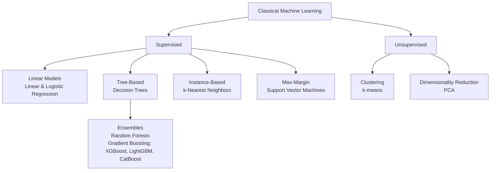

# Topic 04: Classical Machine Learning

## Introduction

[The previous topic](topic-03-learning-paradigms.md) gave you the *categories* of learning. This topic gives you the *methods*. Classical Machine Learning is the toolbox of algorithms developed largely between the 1950s and the 2000s (linear regression, decision trees, k-nearest neighbors, k-means, and their relatives) before deep learning took over the headlines.

"Classical" does not mean obsolete. These algorithms learn from **structured data** (tables of rows and columns) using **features chosen by humans**, and their inner workings are usually simple enough to inspect. That combination of effective, cheap, and explainable is why they still power most of the machine learning running in production today.

## Why It Matters

* **Most real-world ML is classical.** Fraud scores, credit decisions, churn predictions, demand forecasts: the bulk of deployed systems run on tabular data with classical methods, not neural networks.
* **It lives inside modern AI systems too.** Even LLM-based products and agents lean on classical models behind the scenes for ranking, retrieval, recommendations, and fraud detection, so this toolbox never left the stage.
* **It is the honest baseline.** Practitioners fit a simple model first; if a neural network cannot beat logistic regression on your data, the extra complexity is not worth it.
* **It is interpretable.** In lending, healthcare, and hiring you often must explain *why* the model decided what it did. A decision tree can be read line by line; a billion-parameter network cannot.
* **It is cheap.** These models train in seconds on a laptop: no GPUs, no clusters, no special hardware.

## Core Concepts

### What Makes ML "Classical"

Two things separate classical ML from the deep learning that follows it:

1. **Humans choose the features.** You decide that "income," "age," and "number of late payments" are the columns the model sees. The model finds patterns *in* the features; it does not invent them.
2. **The models are simple enough to inspect.** A fitted line has coefficients you can read; a tree has rules you can follow. Understanding is built in, not bolted on.

Deep learning will later flip the first point by learning its own features from raw data, at the cost of the second. That trade-off is the focus of [Topic 08](topic-08-deep-learning.md).

### One Map: The Algorithm Families

The map mirrors [Topic 03](topic-03-learning-paradigms.md): the supervised families predict labels; the unsupervised families find structure without them.

### The Flagship Algorithms

Here you only need to recognize each algorithm: its name, a mental picture, and one line of intuition. The full details come in [Chapter 7](../chapter-07-classical-machine-learning/).

* **Linear regression**: draws the best-fit straight line through numeric data and uses it to predict a number (a house price, tomorrow's demand).
* **Logistic regression**: despite the name, a *classifier*. It squashes a linear score into a probability of "yes" or "no" (what a probability really means is [Topic 06](topic-06-probability-as-output.md)'s job).
* **Decision trees**: a flowchart of yes/no questions learned from data ("Income > 50k? Late payments > 2?"). Follow the branches to a prediction you can read aloud.
* **Random forests**: hundreds of slightly different trees vote, and the crowd is more accurate than any single tree. This is your first taste of *ensembles*, combining weak models into a strong one.
* **Gradient boosting (XGBoost, LightGBM, CatBoost)**: trees built one after another, each correcting the mistakes of those before it. Arguably the dominant family for tabular data today, the default winner of ML competitions and the engine inside countless production systems.
* **k-Nearest Neighbors (k-NN)**: no real "training" at all. To classify a new point, look at its *k* closest neighbors and take a vote. You are the company you keep.
* **Support Vector Machines (SVM)**: finds the widest possible "street" separating two classes, so new points landing near the middle are classified with confidence.
* **k-means**: unsupervised. Pick *k* cluster centers, assign every point to its nearest center, move the centers, and repeat until the groups settle.
* **Principal Component Analysis (PCA)**: compresses many correlated features into a few informative ones, keeping most of the signal while shedding the bulk.

### Classical vs Deep Learning: Who Wins Where

| Situation | Likely winner | Why |
|---|---|---|
| Tabular data (spreadsheets, databases) | Classical (usually gradient boosting) | Hand-crafted features already capture the structure |
| Small datasets (hundreds to thousands of rows) | Classical | Simple models don't overfit scarce data as easily |
| Explanations required (regulation, trust) | Classical | Coefficients and rules are readable |
| Raw perception (images, audio, free text) | Deep learning | Features are too subtle for humans to hand-craft |
| Tight budget or latency | Classical | Trains and predicts in milliseconds on a CPU |

The lesson is not "old vs new" but *fit the tool to the data*.

## Real-World Examples

* **Credit scoring**: banks run logistic regression and gradient boosting on applicant tables, partly because regulators demand explainable decisions.
* **Fraud detection**: card networks score every transaction in milliseconds; gradient-boosted trees are a workhorse here.
* **Churn prediction**: telecoms and SaaS companies use random forests and boosting on customer-behavior tables to flag who is about to leave.
* **Spam filtering**: lightweight linear classifiers over word-frequency features still catch most junk before anything fancy runs.
* **Recommendation ranking**: even AI-heavy products often use a classical model to rank candidate items or retrieved documents before (or inside) an LLM pipeline.

## How It's Built

In practice, every classical ML system follows the same five-stage pipeline:

**preprocess** the raw data (clean it, handle missing values) → **engineer features** (choose and shape the columns) → **train** the model → **evaluate** it → **deploy** it.

Keep that picture in mind: the algorithm is only the middle box, and much of a practitioner's time is spent on the stages around it. Evaluation gets its own treatment in [Topic 05](topic-05-evaluation.md), and training itself, how a model actually adjusts to reduce error, is the story of gradient descent in [Topic 07](topic-07-gradient-descent.md).

In code, the toolbox is astonishingly compact. With **scikit-learn**, the de facto standard Python library, fitting a model is three lines: load the table, `fit`, `predict`. The hard-won ideas of five decades are one import away, which is exactly why the *understanding* you build in this part matters more than the syntax.

## Key Takeaways

* Classical ML means algorithms for **structured, tabular data** with **human-chosen features**, and it is still the majority of production ML.
* The supervised families: linear models, trees and their ensembles, instance-based (k-NN), max-margin (SVM). The unsupervised: clustering (k-means) and dimensionality reduction (PCA).
* **Ensembles beat single models**; gradient boosting (XGBoost, LightGBM, CatBoost) is today's default champion on tables.
* Classical wins on tabular, small, regulated, or budget-constrained problems; deep learning wins on raw perception.
* Classical models still run inside modern AI and agent systems: ranking, retrieval, fraud, recommendations.
* Every system follows the same pipeline: preprocess → features → train → evaluate → deploy.

## References

* **StatQuest with Josh Starmer**: Machine Learning playlist (linear/logistic regression, trees, forests, boosting, PCA, k-means), the clearest visual second angle on each algorithm.
* **Andrew Ng, Machine Learning Specialization** (Coursera): the structured walkthrough of supervised learning fundamentals.
* **Aurélien Géron, *Hands-On Machine Learning*, Part I**: the practice-side companion for when you reach the build chapters.
* **scikit-learn User Guide** (scikit-learn.org): reference documentation for the entire classical toolbox.

## Think About It

1. Two churn models: one is right 91% of the time, the other 89%. Is the first one actually better? What would you want to know before deciding?
2. A bank must explain every rejected loan application. Which algorithms from this topic would you shortlist, and which would you rule out?
3. If gradient boosting dominates tables, why do you think it loses to deep learning on images and text? What is different about the *features*?

## Next Topic

We now have a shelf full of algorithms, but a model that trains is not a model that works. **[Topic 05: Evaluation](topic-05-evaluation.md)** asks the question every practitioner lives by: how do we know whether a model is any good?
