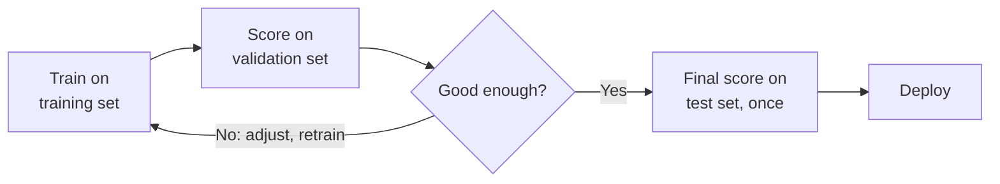

# Topic 05: Evaluation

## Introduction

[The previous topic](topic-04-classical-machine-learning.md) ended with a pipeline: preprocess → features → train → **evaluate** → deploy. This topic is that fourth box. Evaluation is how you find out whether a trained model is actually any good, and "good" has a precise meaning: it performs well on **data it has never seen**.

Notice what changed from ordinary software. A normal program is *verified*: given this input, assert that exact output. A learned model is probabilistic, so there is no exact output to assert. Evaluation therefore shifts from verifying logic to **statistically validating behavior**. It is also the most violated discipline in machine learning: a model that looks brilliant during training can fail embarrassingly in production, and evaluation is what catches the failure before your users do.

## Why It Matters

* **Training success is not real success.** Picture two students: one memorizes every practice question, the other understands the concepts. Both ace the practice set; only one survives the real exam. Models face exactly this test, and the only score that counts comes from unseen data.
* **Metrics decide what ships.** Whether model A replaces model B is settled by numbers. Pick the wrong number and you ship the wrong model.
* **The obvious metric often lies.** On imbalanced problems (fraud, disease, spam), plain accuracy can look excellent while the model is useless. Knowing when accuracy lies is a professional survival skill.
* **It is a safety function.** Evaluation is how biases, failure modes, and vulnerabilities get caught before deployment in places where mistakes hurt: healthcare, lending, autonomous driving. Deciding which error is more acceptable (a false alarm or a miss) is not a technical footnote; it is the decision.
* **It is a recurring theme, not a chapter.** Evaluation returns in classical ML, deep learning, LLMs, and agents, getting harder each time. Benchmarks and LLM evals are this topic wearing new clothes ([Topic 15](topic-15-large-language-models.md)).

## Core Concepts

### The Golden Rule: Test on Unseen Data

Never grade a model on the data it trained on. Training performance answers "did the model absorb this dataset?" Evaluation answers the question you actually care about: "will it work on the next customer, the next transaction, the next email?" That ability to perform on new data is called **generalization**, and it is the real product of machine learning. Good systems generalize; poor systems memorize.

### Overfitting and Underfitting

Two failure modes sit on either side of a good model:

* **Overfitting**: the model memorized the training data, noise and all. It scores brilliantly on what it has seen and poorly on anything new: the student who memorized last year's exam word for word.
* **Underfitting**: the model is too simple to capture the pattern at all. It scores poorly everywhere: the student who only skimmed one page of the textbook.

Evaluation on held-out data is how you detect both. A large gap between training score and unseen-data score is the classic fingerprint of overfitting.

### The Three-Way Split

The standard defense is to split your data before training:

| Split | Purpose | Analogy |
|---|---|---|
| **Training set** | The model learns from it | Homework and practice problems |
| **Validation set** | You compare models and tune settings (hyperparameters) against it | Mock exams |
| **Test set** (the "holdout") | Touched once, at the very end, for the honest final score | The sealed real exam |

The test set is sacred. Peek at it repeatedly while tuning and you quietly overfit to it, which defeats its purpose.

This loop (train, score, adjust, repeat) is the daily rhythm of applied ML. What "adjust" means inside the model is the story of [Topic 07](topic-07-gradient-descent.md).

### Baselines: Beat the Dumb Model First

Before celebrating any score, ask what the laziest possible predictor would get. If 99% of transactions are legitimate, a "model" that always says "not fraud" is 99% accurate and 100% worthless. Every serious evaluation starts by beating a baseline: predict the majority class, predict the average, or predict whatever happened yesterday.

### Judging Classifiers: The Confusion Matrix and Friends

For yes/no predictions, every outcome lands in one of four boxes, together called the **confusion matrix**: true positives and true negatives (correct calls), **false positives** (false alarms) and **false negatives** (misses). The important metrics are just different ratios of these boxes:

* **Accuracy**: fraction of all predictions that were correct. Honest on balanced data, deceptive on imbalanced data.
* **Precision**: of everything the model flagged as positive, how much really was? High precision means few false alarms.
* **Recall**: of everything truly positive, how much did the model catch? High recall means few misses.
* **F1 score**: a single number balancing precision and recall, useful when you need one score to compare models.

Precision and recall pull against each other: flag more aggressively and you catch more real cases (recall up) but raise more false alarms (precision down). Where you set that dial depends on which mistake costs more, and the dial exists because most classifiers do not actually output "yes" or "no" but a probability that you threshold, which is exactly [Topic 06](topic-06-probability-as-output.md)'s subject. One more name to recognize: **ROC-AUC**, a single score for how well a model separates the two classes across *every* possible threshold rather than just one.

### Judging Regressors

When the prediction is a number (a price, a demand forecast), you measure the size of the miss:

* **MAE (mean absolute error)**: the average miss, in the same units you care about ("off by $12,000 per house on average").
* **MSE (mean squared error)**: the average of the *squared* misses, so large errors dominate the score.
* **RMSE (root mean squared error)**: the square root of MSE, back in the original units. Prefer it when big errors are disproportionately painful.

### Cross-Validation: A Fairer Estimate

With small datasets, a single validation split can be lucky or unlucky. **k-fold cross-validation** slices the data into k parts, trains k times with a different slice held out each time, and averages the scores. Every data point takes one turn as the exam, giving a steadier estimate at the cost of extra training runs.

### Benchmarks: Shared Exams for the Field

Everything so far evaluates *your* model on *your* data. To compare models across the field, researchers build **benchmarks**: standardized collections of tasks so that competing models are measured under identical conditions. There are benchmarks for image classification, language understanding, coding, and mathematical reasoning, and public leaderboards rank models against them. Benchmarks are how the field tracks progress objectively, and, as we will see below, how that objectivity gets strained.

### No Universal Metric

The right evaluation depends on the task, because the metric encodes what the task values:

| Task | Typical evaluation |
|---|---|
| Image classification | Accuracy |
| Spam detection | Precision and recall |
| Price forecasting | MAE / RMSE |
| Machine translation | Overlap with human reference texts |
| Code generation | Does the program run and pass tests? |
| Chatbots / LLMs | Benchmarks, human ratings, model judges |

No single number works everywhere. Choosing the metric is choosing what "good" means.

### Evaluating Modern AI

Generative models strained the classic toolkit: when the output is an open-ended paragraph, there is no single right answer to compare against. At recognition depth, the modern additions are:

* **Overlap scores (BLEU, ROUGE)**: count how much generated text matches human reference texts. Cheap and automatic, but blind to meaning and factual accuracy.
* **Perplexity**: how confident the model's next-word predictions are; lower means a better grip on the language.
* **LLM-as-judge**: a strong model grades another model's outputs against criteria like helpfulness and faithfulness (is it grounded in the sources, or hallucinating?).
* **Human preference**: people vote between two anonymous answers, and the votes roll up into chess-style Elo rankings on public arenas. Human preference also *trains* models, the subject of [Topic 19](topic-19-alignment.md).

And three reasons modern evaluation is genuinely hard:

* **Contamination**: benchmark questions leak into internet-scale training data, the grand version of testing on the training set.
* **Saturation**: models max out benchmarks faster than researchers can build harder ones.
* **Goodhart's law**: "when a measure becomes a target, it ceases to be a good measure." Teams tune models to climb famous leaderboards, and the leaderboard stops predicting real-world usefulness.

Deeper treatment of the classical metrics (ROC curves and friends) comes in [Chapter 7](../chapter-07-classical-machine-learning/); evaluating agents, the hardest case of all, waits for [Topic 23](topic-23-ai-agents.md).

## Real-World Examples

* **Spam filtering**: precision matters most. Deleting a real job offer (false positive) hurts far more than letting one junk mail through.
* **Cancer screening**: recall matters most. A missed tumor (false negative) is catastrophic; a false alarm costs a follow-up test. And with a rare disease, a 99% accurate model may catch nothing at all.
* **Fraud detection**: heavy class imbalance makes accuracy nearly meaningless; teams live in precision-recall territory and tune thresholds to fraud economics.
* **Kaggle leaderboards**: competitors who tune obsessively against the public leaderboard often crash on the hidden private one, Goodhart's law in miniature.
* **LLM benchmarks**: a model posting suspiciously high scores on a famous benchmark is now routinely audited for contamination.

## How It's Built

In code, classical evaluation is nearly free. **scikit-learn** ships `train_test_split` to carve the data, `cross_val_score` for k-fold estimates, and `classification_report` to print precision, recall, and F1 in one call. For LLM systems, the same loop runs as an **eval harness**: a suite of prompts with expected behaviors, graded automatically or by a judge model on every change. The hard part is never the code: it is choosing the metric. That choice encodes what the product values (which error hurts more, and how much), so in practice it is made with domain experts and stakeholders, not by the ML engineer alone.

## Key Takeaways

* A model is judged only on **unseen data**; generalization, not memorization, is the product.
* **Overfitting** means memorized and brittle; **underfitting** means too simple to learn. The train-versus-test gap exposes the first.
* Split data into **train, validation, test**; the test set is used once, at the end. **Beat a baseline** before believing any score.
* On imbalanced data accuracy lies; think in **precision** (false alarms) versus **recall** (misses), with **F1** as the balance. For numbers, **MAE**, **MSE**, and **RMSE** measure the miss.
* **Cross-validation** buys a steadier estimate on small data.
* **Benchmarks** are the field's shared exams, and there is **no universal metric**: choosing one is choosing what "good" means.
* Modern AI adds overlap scores, perplexity, **LLM-as-judge**, and **human preference** rankings, and fights **contamination**, **saturation**, and **Goodhart's law**.

## References

* **StatQuest with Josh Starmer**: the Confusion Matrix, Sensitivity and Specificity, and Cross Validation videos, the clearest visual walkthroughs of these ideas.
* **Andrew Ng, Machine Learning Specialization** (Coursera): the model evaluation and selection lectures in Course 2.
* **Google Machine Learning Crash Course**: the Classification module, with interactive precision/recall threshold exercises.
* **Chip Huyen, *AI Engineering***: the evaluation chapters, the best current treatment of benchmarks, LLM-as-judge, and eval harnesses.
* **scikit-learn User Guide** (scikit-learn.org): the Model Evaluation section, the reference for every classical metric here.

## Think About It

1. Return to Topic 04's question: churn model A is right 91% of the time, model B 89%. What would you now ask before crowning A? (Start with: what does "always predict no churn" score?)
2. In airport security screening, which error is worse: a false positive or a false negative? Who should set that threshold: the engineer, the security agency, or the passengers bearing the delays?
3. A model tops a famous benchmark. Then a researcher finds benchmark questions in its training data, and the team admits it tuned for that leaderboard for months. What, if anything, do the scores still tell you?

## Next Topic

Every classification metric above quietly assumed the model outputs a hard yes or no. It almost never does. Underneath, the model outputs a **probability**, and someone chooses where to draw the line. **[Topic 06: Probability as Output](topic-06-probability-as-output.md)** opens that box.
