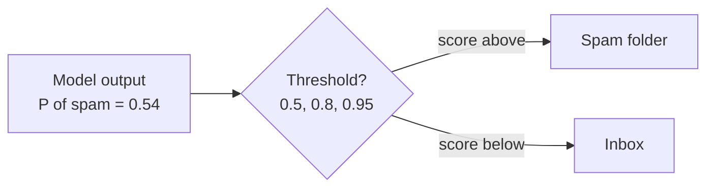

# Topic 06: Probability as Output

## Introduction

Classical software is deterministic. A condition is met or it is not, the same input always produces the same output, and an `if` statement never hedges. Humans are the opposite: "I'm 90% sure it will rain," "this is probably spam," "I think that's a cat, but the photo is blurry." Modern AI models are built like the humans, not like the software.

[The previous topic](topic-05-evaluation.md) ended on a small confession: every classification metric quietly assumed the model outputs a hard yes or no, and it almost never does. Open up any modern model, from a spam filter to ChatGPT, and you will not find an answer inside. You will find a **probability distribution**: a set of candidate outputs, each tagged with how plausible the model finds it. The single answer you see on screen is manufactured afterward, by a rule or a random draw that somebody chose.

This is the chapter's second recurring thread (evaluation was the first), and it may be the most useful mental-model correction in all of AI: **a model never emits an answer, only a distribution over possibilities.** Hold onto that sentence. Nearly everything that seems strange about AI behavior becomes ordinary once you have it.

## Core Concepts

### From Answer to Distribution

At recognition depth, a **probability distribution over outcomes** is a complete list of candidates, each assigned a number between 0 and 1, with all the numbers summing to 1. An image classifier shown a photo does not compute "cat." It computes something like:

| Candidate | Probability |
|---|---|
| Cat | 0.86 |
| Dog | 0.11 |
| Fox | 0.03 |

The headline "It's a cat" throws away two thirds of what the model produced. The 0.11 is real information: the model finds dog plausible but less likely, and on a blurrier photo those numbers drift toward each other. This is also *why* models speak probability in the first place. Real inputs are blurry, noisy, ambiguous, and incomplete, and a system forced to deliver absolute verdicts about an ambiguous world would simply be wrong more often, and silently. A distribution is not the model being vague; it is the model being honest.

### Classifiers: The Threshold Is a Choice

A spam filter does not say "spam." It says 0.97 for one email and 0.54 for another. Both get labeled spam under the usual rule, but they are very different situations: the first is a near-certain verdict, the second a coin flip with a slight lean. Where each email actually goes depends on a **threshold**, and the default of 0.5 is a convention, not a law:

Raise the threshold and you get fewer false alarms but more junk in the inbox; lower it and the reverse. That dial is exactly the precision versus recall decision from [Topic 05: Evaluation](topic-05-evaluation.md), now visible as machinery, and where to set it depends entirely on which mistake costs more:

| Application | Costlier mistake | Threshold strategy |
|---|---|---|
| Cancer screening | A miss | Low bar to flag: catch nearly everything, accept extra follow-ups |
| Spam filtering | A false alarm (a real email buried) | High bar to flag: only hide an email when very sure |
| Fraud detection | Both hurt | Tuned continuously against real financial costs |

Thresholds do not even have to be binary. A production system might act automatically above 0.95, route everything between 0.5 and 0.95 to a human reviewer, and discard the rest. The model owns the probability; the product owns the policy.

### LLMs: A Distribution Over the Next Token

A language model does the same thing at enormous scale. Given "The capital of France is", it computes a probability for *every token in its vocabulary*: perhaps Paris 0.92, located 0.03, a 0.02, and a long tail of thousands more. One token gets chosen, is appended to the text, and the model computes a fresh distribution for the next position. Generated text is a chain of draws from a moving distribution, which is why the regenerate button works: each press is a new run of draws. How a single token gets picked from the list (always the top one? a weighted lottery? something in between?) is the subject of [Topic 18: Sampling](topic-18-sampling.md).

### Confidence Is Not Correctness

That 0.92 is the model's internal plausibility score, not a warranty. A model can report 99% and be flat wrong, and a hesitant 60% can be right. The property you actually want is **calibration**: among all the predictions where the model said 80%, about 80% should turn out correct. Modern deep networks are notoriously badly calibrated, and in a specific direction: **overconfident**, with outputs shoved toward 0 or 1 as a side effect of how they are built and trained. Engineers patch this after training with calibration techniques, the best known being **temperature scaling**, a single dial that softens or sharpens the distribution without changing which candidate ranks first. File the word "temperature" away; the same dial returns with a different job in Topic 18: Sampling. Whether a model's probabilities deserve belief is an empirical question, answered with held-out data, which makes it one more job for the evaluation toolkit you just built.

### No Built-In Way to Say "I Don't Know"

The distribution has no "none of the above" bucket: 100% of belief must land on the list of candidates, so something is always ranked first, even for a question about a country that does not exist. Worse, the shape of the distribution vanishes at the moment of output: a word drawn from a flat, clueless distribution reads exactly like one drawn from a spiky, confident one, same fluent sentence, same authoritative tone. And each emitted token becomes context for the next step, so one plausible-sounding mistake coherently grows an author, a journal, and a page number.

Notice that every abstention you have met so far lives *outside* the model: the review folder, the human-review band, the reject threshold are all policies wrapped around the distribution. For a classifier, that wrapper is enough. For an LLM producing open text, "I don't know" has to be trained in afterward as a behavior ([Topic 19: Alignment](topic-19-alignment.md)), and the full harvest of this seed, hallucination, arrives in [Topic 15: Large Language Models](topic-15-large-language-models.md).

## Why It Matters

With the machinery on the table, the payoffs:

* **It dissolves the regenerate mystery.** Ask the same question twice and get two different answers. A calculator that did this would be broken; a model that does it is working as designed, because both answers were legitimate draws from the same distribution.
* **It relocates "the answer."** The model proposes, a policy disposes: a threshold for a classifier, a sampling rule for an LLM. Every AI product you use has made these choices for you, mostly invisibly.
* **It explains confident nonsense.** The distribution always sums to 100%, even when the model knows nothing about your question. There is always a most plausible next word, and no built-in way to abstain.
* **It finishes the Evaluation story from Topic 05.** Precision versus recall stopped being abstract the moment you saw the threshold: choosing which error hurts more is now a number someone sets on a probability scale.
* **It is the thread that keeps returning.** Sampling and temperature (Topic 18: Sampling), perplexity (met in Topic 05: Evaluation), the softmax function (below, in How It's Built), and the cross-entropy loss that trains nearly everything (Chapter 5: Information Theory): all of them are operations on this one object.

## Real-World Examples

* **Weather forecasts**: "70% chance of rain" is a probability handed to you raw, and nobody finds it strange. Weather apps are the one place the distribution was never hidden.
* **Speech-to-text**: noisy audio of "I need two tickets" might score *two tickets* at 0.78, *new tickets* at 0.15, *few tickets* at 0.07. Your phone types the winner and quietly keeps the runners-up, which is why tapping a transcribed word offers alternatives.
* **Keyboard autocomplete**: the three suggestion buttons above your phone keyboard are the top of a next-word distribution, made visible.
* **Spam folders**: every email you receive was scored, compared to a cutoff, and routed. A borderline 0.54 newsletter sits one threshold tweak away from vanishing.
* **Medical screening**: models output a risk probability; clinicians and policy decide the action threshold, weighing a false alarm against a miss, the exact dilemma from Topic 05: Evaluation.
* **The regenerate button**: pressing it and watching a different answer appear is the cheapest experiment in AI. You are sampling the distribution yourself.

## How It's Built

Inside nearly every classifier and language model, the final layer produces raw, unbounded scores called **logits**, one per candidate. A one-line function then converts them into a legal probability distribution. With exactly two outcomes, that function is the **sigmoid**, which squeezes a single score into a value between 0 and 1. With many outcomes, it is the **softmax**, which exponentiates every score and normalizes the set so it sums to 1: raw scores of 8.5, 6.3, and 4.1 become 0.82, 0.15, and 0.03. In PyTorch it is literally `torch.softmax(logits, dim=-1)`. That single line is the hinge of this topic. Everything before it (how the scores get computed) is the story of Topics 07 through 14; everything after it (how a candidate gets picked, how the numbers get reshaped) waits in Topic 18: Sampling. Training lives here too: the **cross-entropy loss** compares the model's distribution against reality and punishes surprise, gently for near misses and almost without limit for confident wrongness. That loss is formalized in [Chapter 5: Information Theory](../chapter-05-information-theory/), with the underlying mathematics of probability built up in [Chapter 4: Probability and Statistics](../chapter-04-probability-statistics/).

## Key Takeaways

* A model never emits an answer, **only a distribution over possibilities**. The visible answer is manufactured afterward.
* For classifiers, the **threshold** turning a probability into a verdict is a product decision: whichever mistake costs more decides where the bar sits, and graduated policies (auto-act, human review, reject) are common in production.
* An LLM computes a **fresh distribution over every next token**; generated text is a chain of draws, which is why regeneration changes the answer without anything being broken.
* **Confidence is not correctness.** Modern deep networks skew overconfident, and **calibration** (checked with evaluation, patched with tools like temperature scaling) is what makes the numbers trustworthy.
* There is **no built-in abstain**: flat and spiky distributions produce identical-looking words. Classifiers abstain through policy wrappers; an LLM must have "I don't know" trained in.
* **Sigmoid** (two outcomes) and **softmax** (many outcomes) turn raw scores (**logits**) into the distribution, and **cross-entropy** punishes confident wrongness during training.

## References

* **StatQuest with Josh Starmer**: *Probability is not Likelihood*, the cleanest short untangling of the two words this topic leans on.
* **3Blue1Brown**: *Large Language Models explained briefly*, watch for the moment the next-word distribution appears on screen.
* **Andrej Karpathy**: *Deep Dive into LLMs like ChatGPT*, shows the token distribution machinery end to end, at length.
* **Goodfellow, Bengio, and Courville, *Deep Learning***: chapter 3, Probability and Information Theory, the standard formal treatment for when you want rigor later.
* **Guo et al., *On Calibration of Modern Neural Networks* (2017)**: the paper behind the "modern networks are overconfident" claim, for when you want the evidence.

## Think About It

1. An email scores 0.54 spam. Design the full policy: above what score does mail go straight to spam, in what band would you surface it in a "review" tab instead, and who in the company should own those numbers?
2. You ask an LLM a factual question, get a confident answer, press regenerate, and get a different confident answer. What does that pair of outputs tell you about what the model actually computed, and how should it change your trust in either answer?
3. A medical model outputs "92% probability of disease" for a patient. Using only tools from Topic 05: Evaluation, sketch an experiment that would tell you whether that 92% deserves to be believed.

## Next Topic

We now know what a model produces: a distribution, its spread of belief over the possibilities. Training therefore has a precise job description: reshape that distribution until reality stops surprising it, with cross-entropy keeping score. The mechanism that does the reshaping, one tiny nudge at a time, is the most important algorithm in modern AI. **[Topic 07: Gradient Descent](topic-07-gradient-descent.md)** opens the hood.
