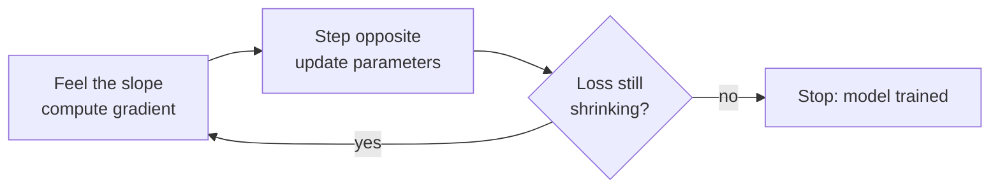

# Topic 07: Gradient Descent

## Introduction

[Topic 02: Machine Learning](topic-02-machine-learning.md) made a promise it has not yet kept. It defined learning as *adjusting a model's parameters to reduce error on data*, and then moved on, as if "adjusting" were a solved problem. It is not obvious at all. A modern language model has billions of parameters. Nudge any one of them and the model's behavior shifts in ways that ripple through every prediction it makes. Which of the billions do you change? By how much? In which direction? Trying combinations at random would not finish before the sun burns out.

The answer that nearly all of modern AI runs on is a single, almost embarrassingly simple idea: **gradient descent**. Measure how wrong you are, find the direction that reduces the wrongness fastest, take a small step that way, and repeat, millions of times. That is the whole algorithm. The spam filter in [Topic 04: Classical Machine Learning](topic-04-classical-machine-learning.md) was trained with it, and so was ChatGPT. The models differ by a factor of a billion in size; the learning rule is the same.

The previous topic ended by handing training a precise job description: reshape the model's probability distribution until reality stops surprising it, with cross-entropy keeping score. This topic is about the mechanism that does the reshaping. As everywhere in this chapter, the treatment is recognition-depth: the pictures and the vocabulary now, the calculus in [Chapter 3: Calculus](../chapter-03-calculus/) and the full engineering discipline in [Chapter 6: Optimization](../chapter-06-optimization/).

## Core Concepts

### The Loss Landscape

Start by turning "how wrong is the model" into geometry. Every setting of the model's parameters produces some amount of error on the training data, measured by a **loss function** (the scorekeeping idea seeded in [Topic 05: Evaluation](topic-05-evaluation.md)). Now imagine a graph: each point on the ground is one possible setting of the parameters, and the height at that point is the loss. Bad parameter settings are mountains. Good ones are valleys. This picture is called the **loss landscape**, and it converts the question "how do we train a model?" into a question a hiker can understand: **starting from a random point, how do you get downhill?**

For a model with two parameters you can literally draw this landscape as rolling terrain. For a model with billions of parameters the "ground" has billions of dimensions and no human can picture it, but the geometry still works, and the hiking metaphor survives almost intact.

### The Gradient: A Compass That Points Uphill

Here is the hiker's predicament, and it is exactly the model's predicament: the fog is total. You cannot see the valley. You cannot see ten feet. All you can do is feel the slope of the ground under your own boots.

That local slope is the **gradient**. At any point on the landscape, the gradient is an arrow that answers two questions at once: *which direction is steepest uphill*, and *how steep is it*. Gradient descent is then one sentence long: **walk in the exact opposite direction of the gradient.** Downhill, the fastest way, one step. Then feel the ground again, because the slope has changed, and step again.



How the slope gets *computed* is deliberately left as a black box here. For the calculus-inclined, the gradient is a vector of partial derivatives, built up properly in [Chapter 3: Calculus](../chapter-03-calculus/). For deep networks with millions of layers-deep dependencies, computing it efficiently is its own celebrated algorithm, and it gets its own stop on this tour: [Topic 09: Backpropagation](topic-09-backpropagation.md). For now, trust that the model can always feel the ground under its boots.

### The Learning Rate: How Big a Step

One number governs the size of each step: the **learning rate**, probably the most famous hyperparameter in machine learning (recall from Topic 04: Classical Machine Learning that a hyperparameter is a dial the engineer sets, not something the model learns). It matters because the gradient only describes the ground *where you are standing*. Take a giant leap based on local information and you may land somewhere the slope pointed nowhere near.

| Learning rate | What training looks like | Outcome |
|---|---|---|
| Too small | Loss inches down; training takes ages | Correct but may never finish, or stalls |
| Too large | Loss bounces wildly, may grow | Overshoots valleys; can diverge entirely |
| Well chosen | Loss falls fast, then settles | The curve engineers hope to see |

The failure modes are worth picturing. Too small, and the hiker shuffles in millimeter steps, technically descending, practically frozen. Too large, and the hiker leaps clear across the valley and lands on the opposite mountainside, higher than before, then leaps back, oscillating forever or ricocheting out of the landscape entirely (in the logs, this is the dreaded moment the loss reads `NaN`). In practice engineers rarely keep the rate fixed: they start larger and shrink it as training proceeds, big strides in open terrain, careful steps near the valley floor. This is called a **learning rate schedule**, and terms like "warmup" and "decay" in ML papers are describing its shape.

### How Much Data per Step: Batch, Stochastic, Mini-Batch

Feeling the slope means measuring loss on training data. On *how much* of it, per step? Three answers, and a trade:

* **Batch gradient descent**: measure on the entire dataset every step. The most accurate compass possible, and hopelessly slow when the dataset is the internet.
* **Stochastic gradient descent (SGD)**: measure on a single example per step. Blazing fast per step, but the compass is jittery: one weird example yanks you sideways.
* **Mini-batch gradient descent**: measure on a small random handful (dozens to a few thousand examples) per step. Nearly all modern training does this, and by convention it is still called SGD.

The jitter, it turns out, is not purely a defect. A slightly noisy compass shakes the hiker out of small dips and dead ends that a perfect compass would settle into. Randomness as a feature is a theme that returns in [Topic 18: Sampling](topic-18-sampling.md).

### Beyond Plain Steps: Momentum and Adam, by Name Only

Plain gradient descent has famous refinements. **Momentum** lets the hiker behave like a heavy ball rolling downhill, accumulating speed in directions that keep agreeing and damping directions that keep flip-flopping. **Adam**, the default optimizer in most modern code, adapts an effective step size for every individual parameter automatically. At recognition depth, the names are all you need: when a paper or a config file says `optimizer=Adam`, it means "gradient descent with quality-of-life upgrades." The mechanics live in [Chapter 6: Optimization](../chapter-06-optimization/).

### Local Minima, and Why It Works Anyway

The landscape is not a single tidy bowl. Real loss landscapes are lumpy, full of **local minima**: valleys that are the lowest point *nearby* while deeper valleys exist elsewhere. A strict downhill walker who reaches one is stuck; every direction out is up. On paper this looks fatal for the entire enterprise.

In practice, it mostly is not, for a reason that surprised the field itself. In the billion-dimensional landscapes of deep learning, getting truly trapped requires the ground to rise in *every one of billions of directions at once*, which is rare; almost always some direction still leads down. High-dimensional geometry, the noise of mini-batch SGD, and momentum together mean that training does not need to find the perfect global minimum. It needs to find any of the many valleys that are good enough, and it reliably does. Why "good enough on training data" also means "good on new data" is the generalization question from Topic 02: Machine Learning, and it stays open until [Chapter 8: Deep Learning](../chapter-08-deep-learning/).

## Why It Matters

* **It is the one algorithm under everything.** Linear regression, spam filters, image classifiers, GPT-4: different models, different losses, same descent. Learn this loop once and you have seen the training of essentially every modern model.
* **It explains what "training" physically is.** Weeks of GPU time and millions of dollars of compute are, concretely, this loop running: measure loss on a mini-batch, compute gradient, step, repeat, trillions of times.
* **It decodes the jargon.** Loss curves, learning rate warmup, divergence, `optimizer=Adam`, "the run blew up": all of it is vocabulary about this one hiker on this one landscape.
* **It reframes model quality as landscape navigation.** Many practical training failures are not mysteries of intelligence; they are a step size set wrong, a compass too noisy, or a valley that was merely local.
* **It connects the chapter's threads.** Evaluation (Topic 05: Evaluation) defined the score; probability (Topic 06: Probability as Output) defined the object being reshaped and the cross-entropy that scores it; gradient descent is the engine that turns score into change.

## Real-World Examples

* **The loss curve**: the single most-watched chart in AI. Engineers babysitting a training run are literally watching the hiker's altitude over time, hoping for a smooth fall and dreading a spike.
* **A `NaN` at 3 a.m.**: the classic training disaster. The learning rate (or a numerical edge case) launched the hiker off the landscape; the loss became not-a-number and the run is dead. Restart from a checkpoint, smaller steps.
* **Learning rate warmup**: recipes for training transformers begin with a few thousand deliberately tiny steps before opening the throttle, because early in training the landscape estimate is unreliable. When you see "warmup steps: 2000" in a config, this is what it is doing.
* **Your phone's keyboard adapting to you**: the model learning your slang is running small gradient descent updates on your typing history, on the device.
* **Fine-tuning** (previewed in [Topic 16: Pretraining vs Finetuning](topic-16-pretraining-vs-finetuning.md)): taking a trained model and continuing gradient descent on new, specialized data. Same loop, new landscape carved by new data.

## How It's Built

In code, the loop is startlingly small. A training step in PyTorch reads almost like the metaphor:

```python
for batch in data:                 # a mini-batch of examples
    predictions = model(batch.inputs)          # forward pass
    loss = loss_fn(predictions, batch.targets) # how wrong? (often cross-entropy)
    loss.backward()                # feel the slope: compute gradients
    optimizer.step()               # take the step: update every parameter
    optimizer.zero_grad()          # reset the compass for the next batch
```

Five lines, and they train everything from a logistic regression to a frontier LLM; only `model`, the data, and the optimizer settings change. The **forward pass** produces predictions, ending in the softmax and cross-entropy from Topic 06: Probability as Output. `loss.backward()` is the black box this topic left sealed: it computes the gradient for every parameter at once, and the algorithm inside it, backpropagation, is precisely [Topic 09: Backpropagation](topic-09-backpropagation.md). `optimizer.step()` moves every parameter a small amount opposite its gradient, scaled by the learning rate, with Adam-style bookkeeping if enabled. Scale this loop across thousands of GPUs and months of wall-clock time and you have described, mechanically, how the largest models on Earth are trained.

## Key Takeaways

* Training is navigation on a **loss landscape**: parameters are coordinates, loss is altitude, and learning means walking downhill.
* The **gradient** is a fog-bound hiker's compass: it reports the local steepest-uphill direction, and gradient descent steps exactly opposite it, over and over.
* The **learning rate** sets step size and is the most consequential dial in training: too small crawls, too large oscillates or diverges, and real recipes schedule it (warmup, then decay).
* Modern training is **mini-batch SGD**: gradients estimated on small random batches, fast and usefully noisy. **Momentum** and **Adam** are refinements you should recognize by name.
* **Local minima** look fatal in two dimensions but rarely are in billions: high-dimensional landscapes, noise, and momentum make "a good enough valley" reliably findable.
* The whole mechanism is a five-line loop: forward pass, loss, `backward()`, `step()`, repeat, and it is the same loop from linear regression to frontier LLMs.

## References

* **3Blue1Brown**: *Gradient descent, how neural networks learn*, the definitive visual treatment of the landscape metaphor.
* **StatQuest with Josh Starmer**: *Gradient Descent, Step-by-Step*, the gentlest walkthrough of the loop with small concrete numbers.
* **Andrej Karpathy**: *The spelled-out intro to neural networks and backpropagation (micrograd)*, builds the entire training loop from scratch in Python; watch the first half now, the rest pays off in Topic 09: Backpropagation.
* **Goodfellow, Bengio, and Courville, *Deep Learning***: chapter 4 (Numerical Computation) and chapter 8 (Optimization for Training Deep Models), the formal treatment for later.
* **Ruder, *An overview of gradient descent optimization algorithms* (2016)**: the standard survey of SGD, momentum, Adam, and relatives, for when the names deserve mechanics.

## Think About It

1. A colleague's training run shows the loss dropping smoothly for an hour, then suddenly exploding to enormous values. Using only this topic's vocabulary, give two plausible diagnoses and what you would change for the next run.
2. Batch gradient descent computes the *true* slope of the landscape, yet almost nobody uses it. Beyond raw speed, what does mini-batch noise buy you? When, if ever, might you want the exact gradient?
3. The hiker metaphor breaks somewhere in billions of dimensions. Name one property of the story (fog, boots, valleys, getting stuck) that you suspect changes meaning at that scale, and how this topic said it changes.

## Next Topic

Gradient descent will happily train any model you hand it, but so far the models on this tour have been modest: linear boundaries, shallow rules, single distributions at the end of a short pipe. The step that changed everything was stacking simple learned layers into deep ones, and letting the same descent loop train all of them at once. **[Topic 08: Deep Learning](topic-08-deep-learning.md)** is where the landscape gets its billion dimensions.
