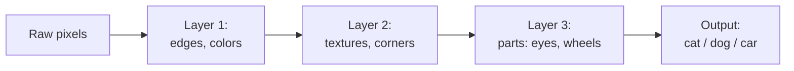

# Topic 08: Deep Learning

## Introduction

Every model on this tour so far has been shallow in a very specific sense. The spam filter from [Topic 04: Classical Machine Learning](topic-04-classical-machine-learning.md) learned which features mattered, but a human decided what the features *were*: count the exclamation marks, flag the word "free", check the sender. The model's entire intelligence sat in one thin learned layer on top of a thick stack of human judgment. That division of labor is the quiet ceiling on all of classical ML. If your hand-picked features fail to capture what matters (and for images, speech, and language, they reliably fail), no amount of clever learning on top can save you. Nobody can write down the features that distinguish a cat from a dog in raw pixels.

**Deep learning** is the bet that broke the ceiling: stop hand-designing features, stack many simple learned layers instead, and let gradient descent shape all of them at once. Each layer learns to transform the output of the layer below it, so the model builds its own features, layer by layer, from raw input to final answer. The previous topic promised a landscape with billions of dimensions; this is the model family that has them.

As throughout this chapter, the treatment is recognition-depth. The pictures, the vocabulary, and the shape of the idea live here; the mathematics of why depth works, and the engineering of making it work, wait for [Chapter 8: Deep Learning](../chapter-08-deep-learning/).

## Core Concepts

### The Neuron: An Almost Insultingly Simple Unit

The basic unit of a neural network is the **neuron** (also called a unit), and it does exactly two things. First, it computes a weighted sum of its inputs plus an offset: multiply each incoming number by a learned **weight**, add them up, add a learned **bias**. Second, it passes that sum through a simple **activation function** that bends the result. That is the entire unit. It cannot recognize a face, parse a sentence, or do anything interesting alone. One neuron is roughly as smart as one line of the linear models from Topic 04: Classical Machine Learning, because that weighted sum *is* a tiny linear model.

The weights and biases are the **parameters**: the numbers gradient descent adjusts, the coordinates on the loss landscape from [Topic 07: Gradient Descent](topic-07-gradient-descent.md). A neuron does not get smarter; its weights get better.

### Layers, and Why Stacking Changes Everything

Arrange neurons side by side and you have a **layer**: every neuron in it looks at the same inputs but with its own weights, so each learns to detect something different. Stack layers so that each one's outputs become the next one's inputs and you have a **neural network**. The layers between input and output are called **hidden layers**, and a network with more than a couple of them is called *deep*, which is all the word "deep" in deep learning has ever meant: many layers.

The power is in what stacking does to features. Each layer learns features *of the previous layer's features*. In an image network, the intuition runs like this: the first layer learns to spot edges and patches of color in raw pixels; the next layer combines edges into corners, curves, and textures; the next combines those into eyes, wheels, or windows; and a late layer combines *those* into "cat face" or "car". No human specified any of it. The hierarchy assembles itself under the pressure of gradient descent, because building reusable intermediate concepts turns out to be the efficient way to drive the loss down.



This is the picture to keep: a deep network is a feature factory where the assembly line itself is learned.

### Non-Linearity: The Ingredient That Makes Depth Real

There is a trap hiding in the design, and the activation function exists to escape it. A weighted sum is a linear operation, and a famous piece of algebra says that any stack of purely linear operations collapses into a single linear operation. Stack a hundred linear layers and you have built, at great expense, one linear layer: exactly the modest models of Topic 04: Classical Machine Learning, with extra steps.

The activation function breaks the collapse by bending each neuron's output non-linearly. The modern default is almost comically simple: **ReLU** (rectified linear unit) outputs its input unchanged if positive, and zero otherwise. One kink, nothing more. But one kink per neuron, times millions of neurons, composed across dozens of layers, lets the network bend and fold its input space into essentially any shape. Non-linearity is what makes depth mean something; without it there is no "deep", only "wide and wasteful". Other activations exist (sigmoid and tanh historically, and softmax at the output, already met in [Topic 06: Probability as Output](topic-06-probability-as-output.md)), but at recognition depth: ReLU inside, softmax at the end, is the shape of most modern networks.

### Representation Learning: The Actual Revolution

Step back and name what changed. Classical ML was **feature engineering**: humans design representations, models learn the final decision. Deep learning is **representation learning**: the model learns the representations too, end to end, from raw input to answer, with gradient descent training every layer jointly against a single loss.

This is the conceptual heart of the topic, and it explains deep learning's economics. Feature engineering does not transfer: pixel features are useless for audio, audio features useless for text, and each domain needed its own decades of expert craft. Representation learning transfers spectacularly: the same recipe (stack layers, pick a loss, run gradient descent) works on images, sound, text, protein structures, and game boards, differing mainly in how the input is fed in. One idea replaced a dozen fields' worth of hand-tuned pipelines, which is why the same chapter can carry you from spam filters to ChatGPT. The learned representations themselves, meaning as vectors that the network invents internally, become a headline topic of their own in [Topic 11: Embeddings](topic-11-embeddings.md).

### Width, Depth, and the Discovery That Scale Is a Strategy

Two dials set a network's size: **width** (neurons per layer) and **depth** (number of layers). Together they set the parameter count, the model's raw capacity to represent complicated functions. The models of Topic 04: Classical Machine Learning had dozens to thousands of parameters. Deep networks casually have millions, and the largest have hundreds of billions.

The classical instinct, trained on the overfitting fears of [Topic 05: Evaluation](topic-05-evaluation.md), says this is madness: more capacity should mean more memorization and worse generalization. One of the defining empirical surprises of the deep learning era is that, past a certain point and with enough data, *bigger keeps getting better*, smoothly and somewhat predictably. That observation hardened into the scaling strategies behind modern AI, and it is the thread to hold onto until [Topic 15: Large Language Models](topic-15-large-language-models.md), where "just make it bigger" becomes the plot.

### What Deep Networks Are Not

The vocabulary (neurons, activations, networks) is borrowed from the brain, and the loan should be repaid with a disclaimer. The resemblance is historical inspiration, not description. Biological neurons are living cells with spikes, chemistry, and timing; artificial neurons are a multiply, an add, and a kink, updated by an algorithm ([Topic 09: Backpropagation](topic-09-backpropagation.md)) that brains almost certainly do not run. Treat "neural" as a name, like "cookie" in a browser: read nothing biological into it. The honest description of a deep network is less romantic and more useful: a very large, very flexible mathematical function, shaped by gradient descent.

## Why It Matters

* **It removed the human bottleneck.** Feature engineering capped every classical system at what experts could articulate. Letting models learn their own representations uncorked the domains (vision, speech, language) where human-designed features had failed for decades.
* **It unified the field.** Before deep learning, computer vision, speech recognition, and natural language processing were separate disciplines with separate toolkits. After it, they are one toolkit with different inputs, which is why this chapter can teach one spine instead of three.
* **It is the substrate of everything ahead.** Backpropagation ([Topic 09: Backpropagation](topic-09-backpropagation.md)) is how these networks train; embeddings ([Topic 11: Embeddings](topic-11-embeddings.md)) are what their layers learn; transformers ([Topic 14: Transformers](topic-14-transformers.md)) are a particular deep architecture; an LLM is a very large one. Every remaining topic in this chapter is about deep networks.
* **It explains the hardware story.** A network is mostly enormous batches of multiplications that can run in parallel, which is exactly what GPUs were built for. The GPU shortage headlines, the chip export politics, the datacenter buildout: all downstream of this topic's architecture choice.
* **It reframes capacity.** "How smart can this model be" becomes, to a first approximation, "how many parameters, trained on how much data": a quantitative dial rather than a design mystery, with consequences that dominate the rest of the tour.

## Real-World Examples

* **ImageNet 2012**: the field's before-and-after moment. A deep network (AlexNet) entered an image-recognition competition dominated by feature-engineered systems and beat them by a margin so large the field pivoted almost overnight. Most histories date the deep learning era from this result.
* **Speech recognition's sudden jump**: after years of slow gains, replacing hand-built acoustic features with deep networks cut error rates dramatically within a few years, which is why dictation on your phone went from novelty to reliable.
* **Face unlock**: a deep network turns your face into a learned representation and compares it to the stored one, running the layered edges-to-parts-to-identity hierarchy on-device in milliseconds.
* **Machine translation**: systems built from hand-crafted linguistic rules and phrase tables were replaced wholesale by deep networks trained end to end, a story that continues in [Topic 12: Sequence Models](topic-12-sequence-models.md).
* **AlphaGo**: deep networks learned board representations that no Go expert could specify by hand, another domain where human feature-writing had hit its ceiling.

## How It's Built

In code, a small deep network is shorter than its own explanation. In PyTorch:

```python
import torch.nn as nn

model = nn.Sequential(
    nn.Linear(784, 128),   # layer 1: 784 pixel inputs -> 128 neurons
    nn.ReLU(),             # the kink: break linearity
    nn.Linear(128, 64),    # layer 2: features of features
    nn.ReLU(),
    nn.Linear(64, 10),     # output layer: 10 scores, one per digit
)
```

Each `nn.Linear` is a layer of weighted sums (its weights and biases are the parameters), and each `nn.ReLU` is the non-linearity that keeps the stack from collapsing. This particular shape reads a 28 by 28 image (784 pixels) and produces 10 scores, which a softmax turns into the probability distribution of [Topic 06: Probability as Output](topic-06-probability-as-output.md).

The punchline is what is *not* here: nothing about training. Hand this `model` to the five-line loop from [Topic 07: Gradient Descent](topic-07-gradient-descent.md) and it trains unchanged, because to the loop, a deep network is just a function with parameters and a loss. The one genuinely new requirement is hidden inside `loss.backward()`: computing gradients efficiently through many stacked layers, the sealed black box that finally opens in [Topic 09: Backpropagation](topic-09-backpropagation.md).

## Key Takeaways

* Deep learning is machine learning done with **many stacked learned layers**, trained jointly by gradient descent; "deep" means nothing more mystical than "several layers".
* A **neuron** is a weighted sum plus a bias plus an activation function; its weights and biases are the parameters gradient descent adjusts.
* **Non-linearity** (usually ReLU) is essential: without it, any stack of layers collapses into one linear layer, and depth buys nothing.
* The core shift is from **feature engineering** to **representation learning**: each layer learns features of the previous layer's features, so the model designs its own edges-to-parts-to-concepts hierarchy.
* One recipe now spans images, speech, text, and beyond, and its capacity scales with **width, depth, and parameter count**; the surprise that bigger keeps working sets up the scaling story of Topic 15: Large Language Models.
* The brain vocabulary is a historical loan. A deep network is a large flexible function shaped by gradient descent, not a model of biology.

## References

* **3Blue1Brown**: *But what is a neural network?*, the definitive visual introduction; layers, weights, and activations as moving pictures.
* **IBM Technology**: *AI vs ML vs DL vs Generative AI*, a short placement of deep learning inside the nesting introduced back in Topic 01: Artificial Intelligence.
* **Goodfellow, Bengio, and Courville, *Deep Learning***: Part II is the formal treatment of everything this topic sketched; chapter 6 (Deep Feedforward Networks) maps directly onto these sections.
* **Krizhevsky, Sutskever, and Hinton, *ImageNet Classification with Deep Convolutional Neural Networks* (2012)**: the AlexNet paper, the historical hinge; skim the results tables to feel the margin.
* **Géron, *Hands-On Machine Learning***: chapters 10 and 11 for the practitioner's view of building and training networks, for when Phase 2 makes this hands-on.

## Think About It

1. A hundred stacked linear layers collapse into one. Explain, in this topic's vocabulary, why inserting a ReLU between each pair prevents the collapse, and what the network would lose if you removed every ReLU from a trained model.
2. Feature engineering encoded expert knowledge directly; representation learning discards it and learns from raw data. Name one thing that is genuinely lost in that trade, and one situation where you might still prefer the classical, hand-engineered approach.
3. The edges-to-parts-to-concepts hierarchy is the standard story for images. Sketch what you would guess the equivalent hierarchy looks like for text, then revisit your guess after [Topic 11: Embeddings](topic-11-embeddings.md) and [Topic 13: Attention](topic-13-attention.md).

## Next Topic

Twice now the tour has walked past the same sealed door. Topic 07: Gradient Descent needed gradients for every parameter and declined to say how they are computed; this topic stacked dozens of layers and quietly made that computation sound harder, since a first-layer weight influences the loss only through everything above it. The algorithm that computes every gradient in one efficient backward sweep, and made training deep networks feasible at all, is **[Topic 09: Backpropagation](topic-09-backpropagation.md)**.
