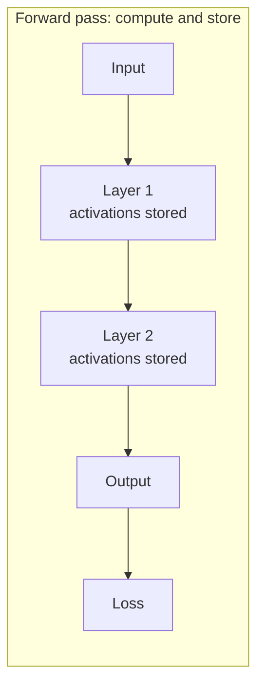
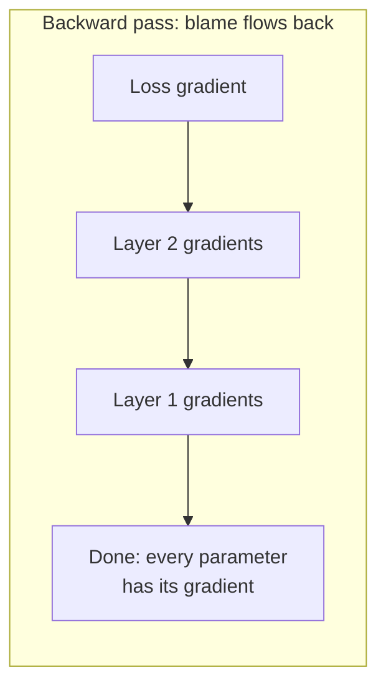

# Topic 09: Backpropagation

## Introduction

Twice this tour has walked past the same sealed door, and both times the sign on it said the same thing. [Topic 07: Gradient Descent](topic-07-gradient-descent.md) built the training loop on one assumption: that for every parameter in the model, someone hands us the gradient, the number saying which way to nudge that parameter to reduce the loss. [Topic 08: Deep Learning](topic-08-deep-learning.md) then made the assumption look expensive, because in a deep network a first-layer weight influences the loss only through everything stacked above it. Its effect is filtered through layer after layer of weighted sums and activation functions before it ever touches the output. How do you assign blame to a parameter buried that deep?

**Backpropagation** is the answer, and it is the single algorithm behind the `loss.backward()` line that has appeared, unexplained, in every training snippet so far. It computes the gradient of the loss with respect to *every* parameter in the network, no matter how deep, in one backward sweep that costs roughly as much as running the network forward once. That efficiency is not a nice-to-have. It is the reason training deep networks is feasible at all, and therefore the reason the modern era described in Topic 08: Deep Learning exists.

As throughout this chapter, the treatment is recognition-depth. The idea, the picture, and the vocabulary live here; the calculus that makes it rigorous, the chain rule in its full multivariable form, waits for [Chapter 3: Calculus](../chapter-03-calculus/).

## Core Concepts

### The Problem: Millions of Dials, One Score

Restate the situation plainly. A network has millions (today, billions) of parameters. After a forward pass on a batch of data, the loss function produces one number measuring how wrong the network was. Gradient descent needs to know, for each individual parameter, how the loss would change if that parameter alone were nudged slightly.

The brute-force approach is obvious and hopeless: nudge one parameter, rerun the whole network, see how the loss moved, undo the nudge, repeat for the next parameter. For a million parameters that is a million forward passes to earn a *single* training step, and training takes millions of steps. The obvious method is millions of times too slow. Backpropagation gets the same answer, exactly, for the price of about one extra pass.

### The Chain Rule: Blame Flows Backward

The trick rests on one idea from calculus, and its intuition survives translation into plain language. If A affects B, and B affects the loss, then A's effect on the loss is the product of the two links: (how much A moves B) times (how much B moves the loss). This is the **chain rule**, and it means influence through a chain of steps can be computed link by link, multiplying as you go.

Now read a deep network through that lens. Every parameter affects the loss through a chain: the weight affects its neuron's output, which affects the next layer's outputs, which affect the layer after that, and so on up to the loss. The chains of different parameters are not independent puzzles. They overlap enormously, because every first-layer weight routes its influence through the *same* upper layers. Compute the upper links once, and every parameter below can reuse them.

That reuse dictates the direction of travel. Start at the loss, where blame originates, and walk backward. First ask how much the output layer's values moved the loss. Then, using that, how much the last hidden layer moved the loss. Then the layer below, and the one below that, each answer built from the answer above it. Blame flows backward through the network, layer by layer, and every parameter picks up its own gradient as the wave passes through its layer. Hence the name: the errors propagate *back*.

### Forward Stores, Backward Reuses

There is one piece of bookkeeping that makes the sweep work. To know how much a weight moved its neuron's output, you need to know what the neuron's inputs *were* during the forward pass. So the forward pass does slightly more than compute the answer: it keeps the intermediate values of every layer, the activations, in memory. The backward pass then walks the same path in reverse, combining those stored values with the incoming blame to produce each parameter's gradient.





This is also why training a network eats so much more memory than merely running it: inference can throw each layer's activations away as soon as the next layer has consumed them, but training must hold them all until the backward pass has passed through. The training-versus-inference asymmetry previewed here becomes its own subject in [Topic 17: Training vs Inference](topic-17-training-vs-inference.md).

### The Computational Graph: One Idea, Any Architecture

The description above sounds tailored to neat stacks of layers, but the idea is far more general. Any computation built from simple differentiable steps can be drawn as a **computational graph**: nodes are operations, edges carry values forward. The forward pass flows values from inputs to loss along the edges; the backward pass flows gradients from the loss back along the same edges, applying the chain rule at every node.

This generality is the quiet superpower. Backpropagation does not care whether the graph is a plain stack of layers, a convolutional network, or the attention machinery waiting in [Topic 13: Attention](topic-13-attention.md). If you can build it from differentiable pieces, blame can flow backward through it, and gradient descent can train it. That is why one training recipe spans every architecture this chapter will meet: the recipe was never about the architecture, only about the graph.

## Why It Matters

Backpropagation is the efficiency result that turns deep learning from a thought experiment into an industry. The comparison is worth making concrete. The nudge-and-rerun method costs one forward pass *per parameter* per step. Backpropagation costs roughly one forward pass plus one comparably priced backward pass, *total*, and delivers every gradient exactly. For a model with a billion parameters, that is the difference between a training step taking seconds and taking decades. Every capability described later in this chapter, from the image classifiers of Topic 08: Deep Learning to the large language models of [Topic 15: Large Language Models](topic-15-large-language-models.md), is downstream of this one algorithm being fast enough.

It also completes the training story this chapter has been assembling in pieces. [Topic 06: Probability as Output](topic-06-probability-as-output.md) said models emit distributions; the loss scores those distributions; Topic 07: Gradient Descent nudges parameters downhill on the loss; backpropagation supplies the directions for the nudges. The loop is now closed with no sealed doors left inside it: forward pass, loss, backward pass, update, repeat, millions of times. When later topics say a model "was trained", this loop, with backpropagation at its heart, is what actually ran.

One caution keeps the recognition honest. Backpropagation is not a learning theory or a model of how brains work (despite the neural vocabulary inherited from Topic 08: Deep Learning, there is no strong evidence the brain does anything like it). It is a bookkeeping algorithm: an efficient way to apply the chain rule to a big graph. The learning comes from gradient descent acting on what backpropagation reports.

## Real-World Examples

**`loss.backward()` in PyTorch.** The five-line training loop from Topic 07: Gradient Descent contained the call all along. When it runs, PyTorch's **autograd** engine, which has been silently recording the computational graph during the forward pass, sweeps backward through it and deposits a gradient on every parameter. The programmer never writes a derivative. This automation, called automatic differentiation, is the core service of every deep learning framework: PyTorch, TensorFlow, and JAX are, at heart, industrial-strength backpropagation machines with neural network libraries attached.

**The same sweep at every scale.** The backward pass that trains a toy digit classifier on a laptop is the same algorithm, unchanged in principle, that runs across thousands of GPUs when a frontier language model trains. The engineering around it grows monstrous (splitting the graph across machines, recomputing some activations instead of storing them to save memory), but the idea being engineered is exactly the one in this topic.

**The 1986 hinge.** Backpropagation's modern form was popularized by Rumelhart, Hinton, and Williams in a short 1986 paper, after earlier independent discoveries. For two decades it trained small networks to modest results, then met large datasets and GPUs in the late 2000s, and the combination produced the deep learning explosion of Topic 08: Deep Learning. The algorithm did not change; the world around it did.

## How It's Built

Recognition-depth means seeing the blame flow once with real numbers. Take the smallest network that still has depth: one input, two layers, each a single weight, no activations.

The forward pass, with input `x = 2`, weights `w1 = 3` and `w2 = 0.5`, and target `t = 1`:

```text
h = w1 * x         = 3 * 2       = 6      (hidden value, stored)
y = w2 * h         = 0.5 * 6     = 3      (output)
L = (y - t)^2      = (3 - 1)^2   = 4      (loss)
```

Now the backward pass. Blame starts at the loss and flows back one link at a time. For this loss, the gradient at the output is `2 * (y - t)`:

```text
blame on y:   2 * (y - t)        = 2 * 2   = 4
blame on w2:  (blame on y) * h   = 4 * 6   = 24
blame on h:   (blame on y) * w2  = 4 * 0.5 = 2
blame on w1:  (blame on h) * x   = 2 * 2   = 4
```

Read what happened. The gradient for `w2` needed `h`, a value stored during the forward pass. The gradient for `w1` did not restart from the loss; it reused the blame already computed for `h` and multiplied in one more link. That reuse is the entire algorithm. A real network replaces single numbers with matrices and inserts activation functions as extra links in each chain, but the pattern is exactly this: one backward walk, each step combining incoming blame with a stored forward value, every parameter collecting its gradient on the way past.

The signs even make sense. Both gradients are positive, meaning increasing either weight increases the loss, which is right: the output `3` overshot the target `1`, so both weights should shrink. Gradient descent, told this, steps them downhill.

## Key Takeaways

* Backpropagation computes the gradient of the loss for **every parameter in one backward sweep**, at roughly the cost of one extra forward pass; the naive alternative costs one full pass per parameter and makes deep learning impossible in practice.
* The engine is the **chain rule**: a parameter's influence on the loss is the product of the links in its chain, and overlapping chains let upper-layer blame be computed once and reused by everything below.
* The **forward pass stores** each layer's activations; the **backward pass reuses** them, which is why training needs far more memory than inference.
* The algorithm operates on **computational graphs**, not specific architectures: anything built from differentiable pieces can be trained this way, which is why one recipe spans classifiers, convolutions, and transformers alike.
* Frameworks automate the whole sweep as **autograd**; `loss.backward()` is backpropagation, and no practitioner writes derivatives by hand.
* Backpropagation is bookkeeping, not biology: an efficient application of calculus, with no strong claim to describing how brains learn.

## References

* **3Blue1Brown**: *What is backpropagation really doing?*, the visual companion to this topic; blame assignment as moving pictures.
* **3Blue1Brown**: *Backpropagation calculus*, the follow-up that opens the chain rule properly; best revisited after Chapter 3: Calculus.
* **Rumelhart, Hinton, and Williams, *Learning representations by back-propagating errors* (1986)**: the paper that made the algorithm canonical; short enough to skim for historical texture.
* **Goodfellow, Bengio, and Courville, *Deep Learning***: section 6.5 is the formal treatment of backpropagation and computational graphs that this topic sketched.
* **Raschka, *Build a Large Language Model (From Scratch)***: shows autograd doing this work inside a real training loop, for when Phase 2 makes it hands-on.

## Think About It

1. The nudge-and-rerun method and backpropagation compute the same gradients. Using the two-layer walkthrough above, count how many forward passes each method needs to get both gradients, then imagine the network has a million weights. Where exactly does backpropagation's saving come from?
2. Training stores every layer's activations; inference discards them immediately. Predict one engineering trick a memory-starved training system might use, then check your guess against the "recomputing activations" aside in the Real-World Examples section.
3. Backpropagation requires every piece of the network to be differentiable, so blame can flow through it. Can you think of a decision a model might need to make that is *not* smooth in this way? Keep the question in mind for [Topic 18: Sampling](topic-18-sampling.md), where the model must turn a smooth distribution into a single discrete choice.

## Next Topic

The training story is complete: forward pass, loss, backward pass, update. But everything so far has quietly assumed the input is already numbers, pixels and measurements that slide straight into the first layer. The chapter's destination is language, and language arrives as raw text, which is not numbers at all. The pivot from *how networks learn* to *how language enters them* begins with the deceptively simple question of how text gets chopped into the units a model actually sees: **[Topic 10: Tokenization](topic-10-tokenization.md)**.
