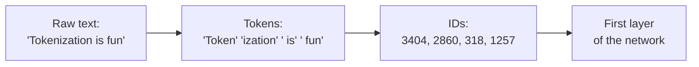

# Topic 10: Tokenization

## Introduction

The training story is finished, and it has a hidden assumption running through every page. The loop from [Topic 07: Gradient Descent](topic-07-gradient-descent.md), the stacked layers of [Topic 08: Deep Learning](topic-08-deep-learning.md), the blame-flow of [Topic 09: Backpropagation](topic-09-backpropagation.md): all of it operates on numbers. Pixels are numbers. Sensor readings are numbers. They slide straight into the first layer's weighted sums without ceremony. But this chapter is headed toward language models, and language does not arrive as numbers. It arrives as text: a stream of characters with no natural notion of multiplication or gradients attached to it.

Something has to stand at the front door and convert. **Tokenization** is that conversion: the process of chopping raw text into a sequence of units called **tokens**, each drawn from a fixed list the model knows, and each mapped to an integer ID the network can actually consume. It sounds like a boring plumbing detail, the kind of preprocessing step a tour could skip. It is not. The choice of how to chop text shapes what a model finds easy, what it finds bizarrely hard, what languages it handles cheaply, and how much you pay per request. A surprising number of famous model quirks are not intelligence failures at all; they are tokenization showing through.

As throughout this chapter, the treatment is recognition-depth. The full craft of building tokenizers, and their role inside the transformer pipeline, waits for [Chapter 9: Transformers and LLMs](../chapter-09-transformers-and-llms/).

## Core Concepts

### Tokens: Not Words, Not Characters

The first instinct is that tokens must be words, and the first instinct is wrong. Open a modern tokenizer and feed it a sentence, and the seams fall in odd places. Common words like `the` or ` and` are single tokens (often with the leading space attached). A rarer word like `tokenization` splits into pieces: perhaps `token` + `ization`. A made-up word like `blorptastic` shatters into several fragments. Numbers split unpredictably: `2024` might be one token, `20456` might be two.

A **token**, then, is best understood as a *frequent chunk of text*: sometimes a whole word, sometimes a piece of one, sometimes a single character, sometimes punctuation with a space stuck to it. The model's world is built from these chunks. It never sees letters, never sees words as such; it sees a sequence of chunk IDs.

### The Vocabulary: A Fixed Menu

Behind every tokenizer sits a **vocabulary**: the complete, fixed list of every token the model can ever see or produce, typically somewhere between 30,000 and 250,000 entries, each with an integer ID. Tokenizing is looking text up against this menu; the output is just the IDs.



The vocabulary is frozen before training begins and never changes afterward. This has a consequence worth sitting with: the model's output side is built on the same menu. When [Topic 06: Probability as Output](topic-06-probability-as-output.md) said a model emits a distribution over possibilities, for a language model those possibilities are exactly the vocabulary: one probability per token, tens of thousands of numbers, out of which [Topic 18: Sampling](topic-18-sampling.md) will eventually pick one. The menu defines the entire space of what the model can say next.

### The Goldilocks Problem

Why chunks, though? Two simpler designs sit at the extremes, and both fail instructively.

**Character-level** tokenization uses single characters as tokens. The vocabulary is tiny and nothing is ever unknown, but every sequence becomes enormously long: a paragraph is a thousand tokens instead of two hundred. Models pay for length twice over, in compute and in how far back they can attend, so character-level burns the budget on spelling out words the model should just recognize.

**Word-level** tokenization uses whole words. Sequences are short, but the vocabulary explodes: every name, typo, plural, verb form, and technical term needs its own entry, and the list never ends. Worse, any word not in the list at training time becomes an unknown-word token at use time, a blank the model cannot see into. New words are invented daily; a word-level model is permanently behind.

**Subword** tokenization is the compromise that won: keep whole tokens for frequent words, split rare words into reusable pieces, and fall back to characters only in the worst case. Nothing is ever unknown (any text decomposes into *something* on the menu), yet common text stays compact. The two failure modes are traded against each other, and the trade landed in the middle.

### Byte Pair Encoding: Let Frequency Decide

The dominant recipe for choosing the menu is **byte pair encoding (BPE)**, and at recognition depth it is one loop. Start with the smallest possible units (characters, or raw bytes). Scan a huge pile of training text and find the *pair* of adjacent units that occurs most often. Merge that pair into a new single token and add it to the vocabulary. Repeat: find the now-most-frequent pair, merge, add. Stop when the vocabulary reaches the target size.

That is the whole algorithm. No linguist decides where words should split; frequency decides. English `ing` becomes a token because English text glues those letters together constantly. And this reveals what a vocabulary really is: a compressed statistical portrait of the training text. Text that resembles the training pile tokenizes into few, chunky tokens; text that does not (other languages, code in a rare dialect, unusual names) shatters into many small ones. The menu is not neutral. It inherits the biases of whatever pile it was carved from.

## Why It Matters

Tokenization is the decoder ring for a whole family of famous model quirks, and recognizing them as tokenizer artifacts, not reasoning failures, is one of the most practical intuitions this chapter offers.

**Spelling and letter games are hard because the model cannot see letters.** Ask a model how many r's are in `strawberry` and it must answer about a word it perceives as perhaps two opaque chunks, `straw` + `berry`, with no letter-level view inside them. It is being asked about the pixels of an image it only ever saw as a thumbnail. The same goes for reversing strings, acrostics, and rhyme by spelling.

**Arithmetic is wobbly partly because numbers tokenize inconsistently.** If `2024` is one token but `20456` splits as `204` + `56`, then digit-by-digit procedures like carrying have to fight the chunking. Some of the arithmetic weakness in language models is exactly this.

**Non-English text costs more.** A vocabulary carved mostly from English text represents English compactly and everything else verbosely. The same sentence can cost two or three times the tokens in another language, which means less fits in the context window and each request costs more. Tokenization is where a model's training-data bias becomes literally billable.

**Everything is priced and limited in tokens.** API pricing, context window sizes, and generation speed are all denominated in tokens, not words or characters. The context windows of [Topic 20: Prompting and Context Windows](topic-20-prompting-and-context-windows.md) are token budgets, and this topic is what a token *is* when that bill arrives.

## Real-World Examples

**Tokenizer playgrounds.** Both OpenAI and Anthropic model families come with inspectable tokenizers, and web playgrounds exist where you can paste text and watch the seams appear: common words as single colored chunks, rare words splitting, spaces glued to the token that follows. Ten minutes in one of these teaches more than any description; it is the recommended lab for this topic.

**The rule of thumb.** For English text, one token is on average about three quarters of a word, so 1,000 tokens is roughly 750 words. This conversion is burned into every developer's head because API bills and context limits demand it.

**Vocabulary sizes in the wild.** GPT-2 used a vocabulary of about 50,000 tokens; newer frontier models run from around 100,000 to over 250,000, partly to represent more languages compactly. Bigger menus mean shorter sequences but a wider final layer, another trade-off knob.

**One tokenizer per model family.** A model is inseparable from the tokenizer it was trained with; feed it IDs from a different menu and the input is gibberish. This is why "the same text" is a different number of tokens on different models, and why tokenizers ship as part of the model.

## How It's Built

Recognition-depth means watching BPE run once by hand. Take a toy training corpus, absurdly small:

```text
low low low lower lowest
```

Start character-level. The word `low` appears in every word here, so pair frequencies pile up fast. Count adjacent pairs across the corpus: `l`+`o` occurs 5 times, `o`+`w` occurs 5 times, everything else less.

**Merge 1**: `l` + `o` is (jointly) most frequent. Merge it into a new token `lo`. The corpus, re-chunked, now reads `lo w lo w lo w lo w e r lo w e s t`.

**Merge 2**: now `lo` + `w` occurs 5 times, the clear winner. Merge into `low`. The corpus reads `low low low low e r low e s t`, and a whole word has crystallized as a single token purely from frequency.

**Merge 3**: `e` appears after `low` twice; suppose `low` + `e` wins next, giving `lowe`, the shared stem of `lower` and `lowest`.

Three merges in, the vocabulary already mirrors the corpus's structure: the common word is one chunk, the shared stem of its variants is another, and the rare endings `r` and `st` remain small pieces. Run the same loop on terabytes of internet text for tens of thousands of merges and the result is a modern vocabulary: `the` and ` and` as single tokens, `ization` as a reusable suffix piece, and every model quirk in the Why It Matters section already latent in the menu.

Tokenizing new text afterward is simply replaying the learned merges on it, then looking up IDs. Note what the model receives at the end: not the chunks themselves but their integer IDs, and an ID is a pure label. ID 3404 is not "closer to" ID 3405 in meaning; the numbers carry no meaning at all yet. That gap is deliberate, and it is the next topic's job to fill it.

## Key Takeaways

* Tokenization is the model's front door: raw text is chopped into **tokens**, frequent chunks drawn from a fixed **vocabulary**, and mapped to integer IDs before the network sees anything.
* Tokens are **subwords**, the compromise between character-level (nothing unknown, but sequences too long) and word-level (short sequences, but an unbounded menu and unknown words).
* **Byte pair encoding** builds the menu by repeatedly merging the most frequent adjacent pair in a training pile; frequency, not linguistics, decides the seams, so the vocabulary inherits the pile's biases.
* Famous quirks are tokenizer artifacts: **spelling and letter-counting failures** (the model never sees letters), wobbly **arithmetic** (inconsistent number chunking), and **higher cost for non-English text** (a menu carved from English).
* Context windows, API pricing, and generation speed are all denominated in **tokens**; roughly 1,000 tokens is 750 English words.
* The model's output distribution from Topic 06: Probability as Output is a distribution **over this vocabulary**: the menu defines everything the model can possibly say next.

## References

* **Hugging Face**: *What is tokenization?*, the short visual introduction; watch the seams appear on real sentences.
* **Karpathy**: *Let's build the GPT Tokenizer*, the definitive deep dive; long, but the first half hour alone will cement everything in this topic, and the quirks section is a delight.
* **Sennrich, Haddow, and Birch, *Neural Machine Translation of Rare Words with Subword Units* (2016)**: the paper that brought BPE into modern NLP; the algorithm section is one page.
* **Jurafsky and Martin, *Speech and Language Processing***: chapter 2 covers tokenization and BPE formally, with worked examples close to this topic's toy corpus.
* **Raschka, *Build a Large Language Model (From Scratch)***: chapter 2 implements a tokenizer in code, for when Phase 2 makes this hands-on.

## Think About It

1. Paste a paragraph of English and a paragraph of any other language you know into a tokenizer playground and compare token counts. Using this topic's vocabulary, explain exactly where the difference comes from and who ends up paying for it.
2. A model is asked to reverse the string `tokenization`. Walk through why this task is harder than it looks from the model's side of the front door, and propose one way to make it easier *without changing the model* (hint: change how the text arrives).
3. BPE lets frequency in the training pile decide the vocabulary. Name one advantage and one danger of having no human in that loop, and connect the danger to the bias discussion coming in [Topic 19: Alignment](topic-19-alignment.md).

## Next Topic

Tokenization ends with a confession: the IDs it hands the network are pure labels. ID 3404 means nothing, sits nowhere, and is no closer in meaning to ID 3405 than to ID 90000. Yet somewhere between these arbitrary integers and the model's fluent output, tokens acquire *meaning*: `king` ends up near `queen`, `Paris` relates to `France` the way `Rome` relates to `Italy`. The step that turns labels into points in a space where distance is similarity, arguably the most beautiful idea in this whole chapter, is **[Topic 11: Embeddings](topic-11-embeddings.md)**.
