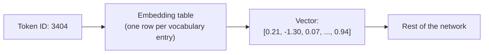

# Topic 11: Embeddings

## Introduction

[Topic 10: Tokenization](topic-10-tokenization.md) ended with a confession. The front door chops text into tokens and hands the network a sequence of integer IDs, and those IDs are pure labels. ID 3404 is not closer in meaning to ID 3405 than to ID 90000. The numbers were assigned by a frequency-counting algorithm that knows nothing about meaning, and nothing about meaning survives in them. If the story stopped there, a language model would be a machine for shuffling arbitrary serial numbers.

Yet the models clearly do work with meaning. Ask one about monarchs and it moves fluidly between `king`, `queen`, and `throne`; it knows `Paris` relates to `France` the way `Rome` relates to `Italy`; it treats `happy` and `joyful` as near-neighbors and `happy` and `carburetor` as strangers. Somewhere between the arbitrary IDs going in and the fluent behavior coming out, meaning gets built.

**Embeddings** are where it happens. An embedding is a list of numbers, a **vector**, assigned to each token, and the assignment is learned so that *geometry mirrors meaning*: tokens with similar meanings end up with nearby vectors, and relationships between meanings become consistent directions in the space. It is arguably the most beautiful idea in this chapter, and one of the most consequential in all of modern AI, because it generalizes far beyond words. Anything can be embedded: sentences, images, songs, products, faces, code. Once something is a point in a space where distance means similarity, a whole family of problems (search, recommendation, retrieval, clustering) reduces to measuring distances.

As throughout this chapter, the treatment is recognition-depth. The linear algebra that makes vectors precise lives in [Chapter 2: Linear Algebra](../chapter-02-linear-algebra/), and the role of embeddings inside the transformer pipeline waits for [Chapter 9: Transformers and LLMs](../chapter-09-transformers-and-llms/).

## Core Concepts

### The Embedding Table: From Label to Vector

Mechanically, an embedding layer is almost anticlimactic: it is a giant lookup table. One row per token in the vocabulary, and each row is a vector of perhaps a few hundred to a few thousand numbers. When token ID 3404 arrives, the layer looks up row 3404 and hands the network that vector. That is the entire operation.

The magic is not in the lookup; it is in *what the rows contain*. Those numbers are not designed by anyone. They are **weights**, exactly like the weights in every layer from [Topic 08: Deep Learning](topic-08-deep-learning.md), initialized randomly and adjusted by the training loop of [Topic 07: Gradient Descent](topic-07-gradient-descent.md). At the start of training, every token's vector is meaningless noise. By the end, the table encodes a map of meaning. The model was never told what any word means; the vectors are simply whatever values made the training objective easiest to satisfy, and it turns out the easiest arrangement is one where meaning and geometry align.

### Meaning as Geometry

Picture each vector as a point in a space. Not a 2D or 3D space you can see, but one with hundreds of dimensions; the intuition transfers anyway. In a trained embedding space:

* **Distance is similarity.** The vectors for `happy` and `joyful` sit close together. `happy` and `sad` are nearer to each other than either is to `carburetor`, because they at least inhabit the same emotional neighborhood. Words cluster: days of the week form a clump, country names form a clump, programming terms form a clump.
* **Similarity is measurable.** Two standard rulers exist. The **dot product** multiplies vectors component by component and sums; large when vectors point the same way. **Cosine similarity** is the dot product with lengths normalized out, measuring only the angle between vectors: 1 for same direction, 0 for unrelated, negative for opposed. Both reduce "how alike are these two meanings?" to one arithmetic operation. The dot product in particular is worth remembering by name; it returns as the beating heart of [Topic 13: Attention](topic-13-attention.md).

This is the payoff of the whole construction. "Meaning" is a slippery philosophical notion, but "the angle between two vectors" is a number a machine computes in nanoseconds. Embeddings convert an unmeasurable question into a measurable one.

### Directions as Relationships

The space holds a second, stranger kind of structure. Not just *positions* but *directions* carry meaning. The most famous demonstration: take the vector for `king`, subtract the vector for `man`, add the vector for `woman`, and the nearest token to the resulting point is `queen`. The displacement from `man` to `woman` is roughly the same arrow, wherever you apply it: it also carries `uncle` toward `aunt` and `actor` toward `actress`. Likewise there is a consistent capital-of direction (`Paris` minus `France` lands near `Rome` minus `Italy`), a plural direction, a past-tense direction.

Relationships between concepts become *arrows in the space*, reusable across word pairs. Nobody engineered this. It emerged, and its emergence is the clearest early evidence that networks trained on raw text build genuine internal structure rather than memorizing surface patterns. The demo is cleanest in classic standalone embeddings (word2vec-era); modern LLM embeddings are messier, but the underlying principle, meaning encoded in geometry, carries straight through.

### Learned by Company Kept

How can training possibly discover meaning from raw text with no dictionary attached? The answer is an old linguistic insight called the **distributional hypothesis**: *a word is known by the company it keeps*. Words with similar meanings appear in similar contexts. `coffee` and `tea` both show up near `cup`, `hot`, `morning`, and `drink`; `coffee` and `algebra` share almost no neighbors.

Training exploits this. Whether the objective is predicting a word from its neighbors (the classic word2vec setup) or predicting the next token (the LLM setup previewed since [Topic 06: Probability as Output](topic-06-probability-as-output.md)), the network can only do the job well if tokens that behave alike in text receive vectors it can treat alike. Gradient descent therefore pushes contextual look-alikes together, one tiny nudge per training example, billions of times over. Similar company forces similar vectors; meaning-as-geometry falls out as a side effect of prediction.

The limits of the method are also visible in its mechanism. The vectors inherit whatever company the training text keeps, including its stereotypes: if the text places one gender near certain professions more often, the geometry faithfully records that too. The map reflects the territory it was drawn from, a thread picked up again in [Topic 19: Alignment](topic-19-alignment.md).

### Beyond Words: Everything Embeds

Nothing in the recipe is specific to words. Any object that appears in learnable context can be assigned a vector: whole sentences and documents, images, audio clips, users and products, snippets of code, protein sequences. Modern systems even train *joint* spaces, where an image of a dog and the caption "a dog" land near each other, so that text can be used to search pictures directly.

This is the sense in which embeddings are a universal adapter. The messy, incomparable objects of the world are projected into one kind of thing, points in a vector space, and from then on a single toolkit applies to all of them.

## Why It Matters

Embeddings earn a full topic because they are load-bearing in three separate ways.

First, they are the **foundation the rest of the language model stands on**. Every transformer begins by embedding its input tokens; everything [Topic 13: Attention](topic-13-attention.md) and [Topic 14: Transformers](topic-14-transformers.md) do is arithmetic on these vectors. Attention in particular is built on the dot-product similarity introduced above; understanding embeddings now is what will make attention feel like recognition rather than revelation.

Second, they are a **product category of their own**. Semantic search, recommendation engines, duplicate detection, clustering, and the retrieval step of [Topic 21: RAG](topic-21-rag.md) are all, at their core, "embed everything, then find nearest neighbors." A large fraction of practical AI engineering is exactly this pattern, often with no text generation involved at all.

Third, they mark a **conceptual turning point in the chapter**. Up to now, the tour has described machinery: losses, gradients, layers, tokens. Embeddings are the first place the machinery visibly produces something that looks like understanding, structure nobody put in. Holding both facts at once, that the structure is real *and* that it emerged from mere prediction over token company, is the right mental posture for everything ahead, especially [Topic 24: AI Is Not Magic](topic-24-ai-is-not-magic.md).

## Real-World Examples

**Semantic search versus keyword search.** A classic keyword search for "how to make my laptop faster" misses a document titled "Speeding up a slow notebook computer": barely a word overlaps. Embed the query and the documents into the same space, and the two land close together, because they mean the same thing. Nearest-neighbor lookup returns the document keyword matching never could. Most modern search, from help centers to code search, runs on this.

**Recommendations.** Streaming services embed songs, films, and users into shared spaces where "users like you" and "songs like this" are literal neighborhoods. A recommendation is a nearest-neighbor query: find points close to the ones you already liked. The same geometry powers "customers also bought" and "similar articles."

**Retrieval for language models.** In [Topic 21: RAG](topic-21-rag.md), a model is given relevant documents fetched at question time. The fetching is embedding search: embed the question, embed the document library ahead of time, retrieve the nearest chunks. The quality of an entire RAG system often lives or dies on the quality of its embedding model.

**Deduplication and moderation.** Embed two images or two paragraphs and check the distance: near-identical points flag duplicates, near-known-bad points flag policy violations, even when the surface bytes differ completely. Comparing meanings instead of characters is the whole trick.

## How It's Built

A miniature version makes the learning mechanism concrete. Take a tiny corpus of sentences about beverages: "I drank hot coffee this morning", "she poured hot tea into a cup", "cold juice in the morning", and so on. Give every word a random 2D vector, just two numbers each, so the space can be drawn on paper.

Now run a simple prediction game over the corpus: repeatedly pick a word and ask the network to predict it from the words around it, using the current vectors as inputs. Early on, predictions are garbage; the vectors are random. But every mistake sends gradients back into the table (this is the blame-flow of [Topic 09: Backpropagation](topic-09-backpropagation.md), reaching all the way into the embeddings), nudging the vectors so the same mistake shrinks next time.

Watch what the nudges do. `coffee` and `tea` keep appearing in interchangeable slots, after `hot` and near `cup` and `morning`. The only way the network can predict those shared contexts well is to move `coffee` and `tea` toward each other, so that whatever it learns about one slot transfers to the other. Meanwhile `juice` drifts toward them but keeps company with `cold`, so it settles nearby but not on top. Words that never share company, say `coffee` and `into`, feel no pull together and drift apart. After enough passes, sketching the 2D points shows a beverage cluster, a temperature pair, and grammar words off in their own region: a map of the corpus's meanings, grown from random noise plus prediction pressure alone.

Scale the same loop up (a vocabulary of 100,000 tokens, vectors of 1,000 dimensions, terabytes of text) and the toy becomes the real thing. The extra dimensions matter: two dimensions can only hold a few distinctions, while a thousand can hold neighborhoods for chemistry, sarcasm, Python syntax, and 18th-century poetry simultaneously, each carving out its own directions. In a full LLM the table is not even trained as a separate step; it is simply the first layer, learning alongside everything else under the same next-token objective, and refined further as vectors flow through the network. That refinement story, where a token's vector is progressively updated by its neighbors in the sentence, is exactly where [Topic 13: Attention](topic-13-attention.md) picks up.

## Key Takeaways

* An **embedding** assigns each token a learned **vector**, turning meaningless IDs into points in a space where **distance means similarity**: the step that gives the model something meaning-like to compute with.
* Mechanically it is a lookup table of weights, trained by the same gradient descent as every other layer; the geometry is **learned, not designed**.
* **Dot product** and **cosine similarity** turn "how alike are these meanings?" into one arithmetic operation; the dot product returns as the core of [Topic 13: Attention](topic-13-attention.md).
* Relationships become **directions**: the king − man + woman ≈ queen structure emerged from training, unprogrammed.
* Learning works through the **distributional hypothesis**: words in similar company are pushed toward similar vectors, which also means the space inherits the training text's biases.
* Embeddings are a universal adapter: sentences, images, products, and code all embed, powering **semantic search, recommendations, and the retrieval inside [Topic 21: RAG](topic-21-rag.md)**.

## References

* **Computerphile**: *Word embeddings / word2vec*, the friendliest introduction to meaning-as-geometry and the famous vector arithmetic.
* **Jay Alammar**: *The Illustrated Word2vec*, the classic visual walkthrough; the diagrams of the prediction game map directly onto this topic's How It's Built section.
* **3Blue1Brown**: the embedding segments of *Transformers, the tech behind LLMs* show where the table sits inside a real model, animated.
* **Mikolov et al., *Efficient Estimation of Word Representations in Vector Space* (2013)**: the word2vec paper that made embedding spaces famous; skim for the analogy results.
* **Jurafsky and Martin, *Speech and Language Processing***: the Vector Semantics and Embeddings chapter is the formal treatment, including cosine similarity worked in full.

## Think About It

1. The word `bank` means both a financial institution and the side of a river, but the table gives it exactly one vector. Where in the space would you expect that vector to sit, and what would it take for a model to tell the two senses apart? (You will meet the answer in [Topic 13: Attention](topic-13-attention.md).)
2. A company embeds its product catalog and job applicants' resumes with a model trained on general web text. Using the distributional hypothesis, predict one useful behavior and one biased behavior this system might exhibit, and explain where each comes from.
3. Cosine similarity ignores vector length and measures only direction. Invent a case where two vectors point the same way but you would *not* want to call the items identical in meaning, and argue whether the dot product would handle your case better or worse.

## Next Topic

Embeddings hand every token a meaningful vector, but so far each token gets its vector *alone*: `bank` receives the same point whether the sentence is about loans or rivers, and the model still has no way to read a sequence *as a sequence*, where order changes everything. Before the modern answer to that problem, the tour visits the older one: networks that walked through text one step at a time, carrying a memory as they went, and the painful limits that eventually broke them. That story is **[Topic 12: Sequence Models](topic-12-sequence-models.md)**.
