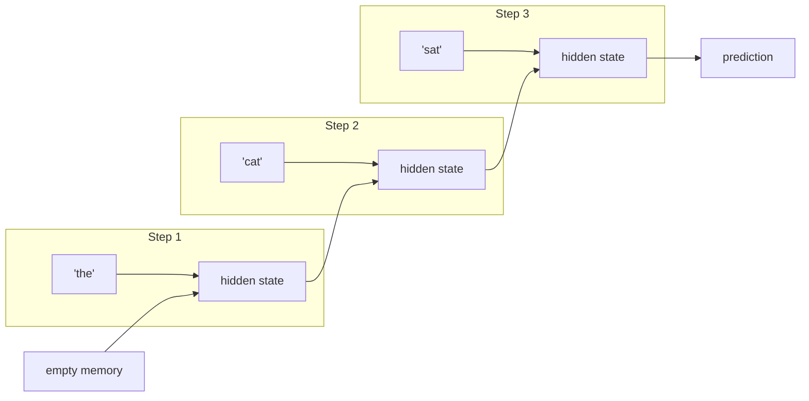

# Topic 12: Sequence Models

## Introduction

[Topic 11: Embeddings](topic-11-embeddings.md) left the tour with a subtle unsolved problem. Every token now carries a meaningful vector, but each token receives its vector *alone*, looked up from a table that has never seen the sentence. The word `bank` gets the same point whether the text is about loans or rivers. Worse, the network still has no notion of *order*. "Dog bites man" and "man bites dog" contain identical tokens, and a model that merely pools their vectors together cannot tell the two apart, even though one is a Tuesday and the other is a headline.

Language is a **sequence**: the meaning lives not just in the words but in their arrangement, and sentences come in every length from one word to a thousand. The plain stacked networks of [Topic 08: Deep Learning](topic-08-deep-learning.md) are a poor fit for this. They expect a fixed-size input, a set number of values arriving all at once, the way an image arrives as a fixed grid of pixels. A sentence is neither fixed in size nor meaningful without its order.

Before the modern answer to this problem, the field spent two decades on an older one, and this topic tells its story: **recurrent neural networks (RNNs)**, machines that walk through a sequence one step at a time, carrying a running memory as they go, and **LSTMs**, the cleverest patch ever applied to them. The design is elegant, it powered a generation of real products, and it failed in two specific, instructive ways. Those failures are the reason [Topic 13: Attention](topic-13-attention.md) exists. Learn what broke, and the modern architecture will feel less like an invention and more like an inevitability.

As throughout this chapter, the treatment is recognition-depth. The full mechanics of recurrent architectures live in [Chapter 8: Deep Learning](../chapter-08-deep-learning/).

## Core Concepts

### The Loop: Reading One Step at a Time

The recurrent idea mirrors how a person reads: not the whole page in one glance, but word by word, carrying an evolving understanding forward. An RNN processes a sequence with a single small network applied over and over, once per token. At each step it takes two inputs: the current token's embedding, and a **hidden state**, a vector summarizing everything read so far. It combines them, produces an updated hidden state, and passes that state to the next step.

The hidden state is the model's entire memory: one fixed-size vector, rewritten at every step. After reading "the cat sat on the", the hidden state must contain whatever matters for predicting the next word, compressed into those numbers. The same weights are reused at every step, which is what lets one network handle sequences of any length: a ten-word sentence means ten passes through the same loop, a thousand-word document means a thousand.

Order is now built in for free. "Dog bites man" and "man bites dog" produce different hidden-state trajectories because the words arrive in different orders, and context arrives too: by the time the loop reaches `bank`, the hidden state already remembers whether the sentence mentioned loans or rivers.

### The Vanishing Gradient: Memory That Fades

Training an RNN uses the same machinery as everything else in this chapter: run the loop forward, measure the error, and let [Topic 09: Backpropagation](topic-09-backpropagation.md) send blame backward. But here backpropagation must travel backward *through the steps of the loop*, from the prediction at the end all the way to the words at the beginning, and this is where the design starts to crack.

Blame flowing backward through a step gets multiplied by that step's weights, and after a chain of such multiplications the signal tends to shrink exponentially. Multiply any number less than one by itself fifty times and almost nothing remains. This is the **vanishing gradient problem**: blame from a mistake at step 200 has effectively evaporated by the time it reaches step 5. The practical consequence is brutal. Consider: "The keys, which my brother borrowed last week along with the ladder and never returned, **were** on the table." Choosing `were` over `was` requires remembering `keys` across a long detour. If the gradient vanishes over that span, the network *cannot learn* the connection, no matter how much data it sees. Plain RNNs in practice remember only a handful of steps back; earlier context does not just weaken, it becomes untrainable. (The mirror-image failure, gradients *exploding* as they compound, also occurs, but it has crude effective fixes; vanishing is the deep problem.)

### LSTMs: Memory with Gates

The famous patch arrived in 1997 and took over the field a decade and a half later: the **Long Short-Term Memory** network, or **LSTM**. Its insight is that memory should not be automatically rewritten at every step; it should be *managed*. An LSTM adds a second memory track, a **cell state**, that flows along the sequence mostly undisturbed, plus a set of **gates**: small learned networks that decide, at each step, what to do with it.

Three gates run the show. A **forget gate** decides what fraction of the old memory to keep or discard. An **input gate** decides what from the current word deserves to be written in. An **output gate** decides how much of the memory to reveal to the current step's output. Each gate outputs values between 0 (fully closed) and 1 (fully open), and crucially, the gates are made of weights, so the network *learns when to remember and when to forget* from data. Reading the keys sentence, a trained LSTM can learn to write "subject: plural" into the cell state, hold it through the entire detour with the forget gate open, and release it exactly when the verb arrives.

Because the cell state can pass from step to step nearly untouched, blame flowing backward along it survives long distances instead of vanishing. LSTMs stretched usable memory from a few steps to a few hundred, and that was enough to make neural sequence models genuinely work. From roughly 2013 to 2017, LSTMs (and a streamlined sibling, the GRU) were the technology behind translation, speech recognition, and text generation. When [Chapter 8: Deep Learning](../chapter-08-deep-learning/) treats these architectures properly, the gate arithmetic will get its full derivation; recognition of the roles is enough here.

### The Two Walls

LSTMs fixed the trainability of memory. Two problems remained that no gate could fix, because both are consequences of the loop itself.

**The sequential wall.** Step 47's computation needs step 46's hidden state, so the steps cannot run in parallel: processing a 1,000-token document means 1,000 dependent computations, one after another. Modern hardware, the GPUs that made [Topic 08: Deep Learning](topic-08-deep-learning.md) possible, earns its speed by doing thousands of operations simultaneously, and the recurrent loop simply cannot feed it. Training on internet-scale text was not slow; it was infeasible. The architecture had a hard ceiling on scale.

**The bottleneck wall.** However good the gates, everything the model knows about the sequence so far must squeeze through one fixed-size vector. Summarizing a 50-page contract into a single vector of a few thousand numbers loses information by arithmetic necessity, and the loss lands hardest in the systems that mattered most: translation models of the era read the entire source sentence, compressed it into one vector, and generated the translation from that alone. Long sentences degraded visibly toward their ends, because the vector had run out of room.

Both walls point at the same culprit: the step-by-step loop with a single running memory. The fix would have to abandon the loop entirely, and that is precisely the story of the next topic.

## Why It Matters

This topic is the hinge of the chapter's architecture story, and it earns its place for three reasons.

First, it completes the problem statement that [Topic 13: Attention](topic-13-attention.md) answers. The transformer's defining traits, processing all tokens in parallel and letting every token look directly at every other, are point-by-point negations of the two walls. Meet the walls first, and attention stops being an arbitrary clever trick; it becomes the obvious move, which is the difference between memorizing an architecture and understanding one.

Second, the concepts here outlive the architecture. Hidden state as a running summary, gating as learned control over information flow, the vanishing gradient as the tax on depth (whether depth in layers or depth in time): these ideas recur across modern ML, from the residual connections inside transformers to the state-space models currently being explored as attention's successors. The vocabulary of this topic is permanent even where the architecture is not.

Third, RNNs are not actually dead. For streaming signals, low-power devices, and workloads where inputs genuinely arrive one step at a time, small recurrent models remain a sensible engineering choice. Knowing the trade-offs, cheap sequential inference versus parallel training and unbounded context, is part of an AI developer's working judgment.

## Real-World Examples

**Neural machine translation, 2014 to 2017.** Google Translate's first neural version was an LSTM encoder-decoder: one LSTM read the source sentence into a vector, another generated the target language from it. Quality jumped dramatically over the old phrase-based system, and the bottleneck wall showed up exactly on schedule: long sentences drifted off-meaning toward the end. The first workaround, letting the decoder peek back at all the encoder's hidden states instead of just the final vector, was the embryonic form of attention, born inside an RNN before it replaced one.

**Speech assistants of the LSTM era.** The Siri, Alexa, and Google voice recognition of the mid-2010s ran on recurrent acoustic models: audio is a stream, a natural fit for a network that consumes one step at a time. Keyboard autocomplete of the same era was character-level and word-level RNNs at work.

**Character-level text generation.** Karpathy's 2015 essay *The Unreasonable Effectiveness of Recurrent Neural Networks* showed small character-fed RNNs producing plausible-looking Shakespeare, C code, and LaTeX, complete with balanced braces. It was many readers' first glimpse of a statistical model appearing to write, the direct ancestor of the moment in [Topic 15: Large Language Models](topic-15-large-language-models.md) when scale turns the same trick into something transformative.

## How It's Built

A hand-run loop makes the hidden state tangible. Take a tiny RNN whose job is next-word prediction, with a hidden state of just four numbers, and feed it "the cat sat".

Step 1: the state starts empty, `[0, 0, 0, 0]`. The embedding for `the` (from the table built in [Topic 11: Embeddings](topic-11-embeddings.md)) enters, combines with the empty state through the network's weights, and produces a new state, say `[0.2, -0.1, 0.0, 0.4]`: a faint imprint meaning roughly "a noun is coming."

Step 2: the embedding for `cat` enters alongside that state. The same weights combine them into `[0.7, -0.3, 0.5, 0.1]`, which now encodes something like "subject established, singular, animate." The old state's contents are still in there, but transformed, diluted by the new arrival.

Step 3: `sat` enters, and the state updates again to encode "subject plus past-tense verb, expecting a location or an end." From this final state, an output layer produces the distribution of [Topic 06: Probability as Output](topic-06-probability-as-output.md) over the vocabulary: high probability on `on`, `down`, `quietly`.

Training is the loop of [Topic 07: Gradient Descent](topic-07-gradient-descent.md) wrapped around this whole procedure: the corpus says the next word was `on`, the loss measures the miss, and backpropagation runs backward through step 3, then step 2, then step 1, apportioning blame to the shared weights at every step. Now imagine the sentence were 300 words long, and watch the blame fade multiplication by multiplication on its way back to step 1: the vanishing gradient, felt from the inside. The LSTM version of this walkthrough differs only in that each step also consults its gates, deciding what the four-number memory keeps, gains, and shows.

## Key Takeaways

* Sequences break the fixed-input mold of [Topic 08: Deep Learning](topic-08-deep-learning.md): variable length and order-dependence demand a different design, and **RNNs** answer with a loop, one small network applied per token, passing a **hidden state** forward as memory.
* Backpropagation through many steps multiplies blame down to nothing: the **vanishing gradient problem**, which caps how far back a plain RNN can learn to remember.
* **LSTMs** manage memory with learned **gates** (forget, input, output) over a protected cell state, stretching usable memory to hundreds of steps and powering the 2013 to 2017 generation of translation and speech systems.
* Two walls remained: the loop is **inherently sequential** (no parallel training, no internet scale) and the fixed-size state is an **information bottleneck** (long inputs cannot fit).
* The first fix for the bottleneck, letting a decoder look back at all previous hidden states, was **attention in embryo**; [Topic 13: Attention](topic-13-attention.md) is that idea promoted from patch to foundation.
* The concepts outlive the architecture: running summaries, gated information flow, and the cost of depth reappear throughout modern ML, and small RNNs still earn their keep in streaming and low-power niches.

## References

* **StatQuest**: *RNNs and LSTMs*, the gentlest visual walkthrough of the loop and the gates; watch this first.
* **Christopher Olah**: *Understanding LSTM Networks*, the classic illustrated essay; the gate diagrams here are the ones everyone else borrows.
* **Andrej Karpathy**: *The Unreasonable Effectiveness of Recurrent Neural Networks*, the 2015 essay that made RNN text generation famous; a period piece worth reading as history.
* **Goodfellow, Bengio, and Courville, *Deep Learning***: chapter 10 is the formal treatment of sequence modeling, including backpropagation through time and the vanishing gradient analysis.
* **Jurafsky and Martin, *Speech and Language Processing***: the RNN and LSTM chapter connects the architectures directly to language tasks, bridging into the next topics.

## Think About It

1. The hidden state after reading a sentence is a single vector, and [Topic 11: Embeddings](topic-11-embeddings.md) showed that vectors can encode meaning as geometry. In what sense is a hidden state an *embedding of the sentence so far*, and what could you do with two sentences' final states and a cosine similarity?
2. LSTM gates output values between 0 and 1, learned from data. Describe what a forget gate stuck near 1 for many steps accomplishes, and why that same behavior is exactly what lets blame survive the backward journey.
3. The sequential wall applies to *training* on existing text. When a modern LLM *generates* text, it produces one token at a time, each depending on the last. Does generation therefore hit the same wall? Hold your answer for [Topic 17: Training vs Inference](topic-17-training-vs-inference.md) and see if it survives.

## Next Topic

The RNN era ends with a workaround outgrowing its host: translation models learned to let the decoder glance back at every hidden state of the input, and the glance worked better than the memory it was patching. The 2017 question was radical: if looking directly at every position works so well, why keep the loop at all? Discard the recurrence, keep only the looking, and let every token weigh its relevance to every other token simultaneously, using the dot product from [Topic 11: Embeddings](topic-11-embeddings.md) as the measure of relevance. That mechanism, the one the modern era is built on, is **[Topic 13: Attention](topic-13-attention.md)**.
