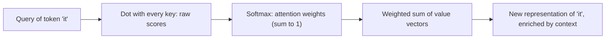

# Topic 13: Attention

## Introduction

Three threads from earlier in this chapter converge here, so gather them first. [Topic 10: Tokenization](topic-10-tokenization.md) chopped text into the units a model actually sees. [Topic 11: Embeddings](topic-11-embeddings.md) turned those units into vectors, made meaning a matter of geometry, and gave us the dot product as a one-number measure of how related two vectors are. [Topic 12: Sequence Models](topic-12-sequence-models.md) then tackled the problem of *order*: RNNs read a sequence token by token, carrying a running summary in a fixed-size hidden state, and LSTMs stretched that memory with learned gates.

But the RNN approach ran into two walls it could not climb. First, the loop is inherently sequential: token 500 cannot be processed until token 499 is done, so training cannot be parallelized, and internet-scale datasets stay out of reach no matter how many GPUs you own. Second, the hidden state is an information bottleneck: everything the model knows about the sequence so far must squeeze through one fixed-size vector, and long inputs simply do not fit. A model translating a paragraph had to compress the entire source text into that single vector before producing a word of output, and quality collapsed as inputs grew.

[Topic 12: Sequence Models](topic-12-sequence-models.md) ended with a patch for the second wall that outperformed the thing it was patching. Translation models of the mid-2010s let the decoder glance back at every hidden state of the input instead of relying on one compressed summary vector, and the glance, introduced by Bahdanau and colleagues in 2014, immediately produced better translations. For a few years that was its whole job: a bolt-on fix for the information bottleneck, living inside an RNN.

Then came the 2017 question, asked in a paper whose title is the answer: *Attention Is All You Need*. If letting positions look directly at other positions works so well, why keep the loop at all? Discard the recurrence entirely. Keep only the looking. Let every token in a sequence measure its relevance to every other token, simultaneously, and build its understanding from a weighted blend of what it finds.

That mechanism is **attention**, and it is the single most important idea in the modern half of this chapter. Everything from here forward, [Topic 14: Transformers](topic-14-transformers.md), [Topic 15: Large Language Models](topic-15-large-language-models.md), and the systems built on top of them, is constructed around it. The good news is that you already own its core ingredient: the dot product from [Topic 11: Embeddings](topic-11-embeddings.md), the operation that measures how similar two vectors are, is doing all the real work. Attention is what happens when similarity-as-geometry is promoted from a way of *comparing* words to the way a model *reads*.

As always in this chapter, the treatment is recognition-depth: the idea, the picture, and the vocabulary. The linear algebra that makes it rigorous lives in [Chapter 2: Linear Algebra](../chapter-02-linear-algebra/).

## Core Concepts

### Relevance Is a Dot Product

Start from what [Topic 11: Embeddings](topic-11-embeddings.md) established. Tokens enter the network as vectors, meaning is encoded as geometry, and the dot product of two vectors is a single number measuring how aligned they are. Similar meanings, large dot product. Unrelated meanings, near zero.

Attention takes that measuring stick and asks a new question with it. Not "are these two words similar?" but "how *relevant* is that token over there to understanding this token right here?" In the sentence "The animal didn't cross the street because it was too tired," the word "it" needs to figure out what it refers to. "Animal" is highly relevant. "Street" is somewhat relevant. "The" is barely relevant at all. If each word is a vector, relevance can be scored with dot products: compare "it" against every other word in the sentence and get a number for each.

That is the entire seed of the mechanism. Everything else is arranging for those comparisons to happen usefully, at scale, with learned parameters.

### Queries, Keys, and Values

Raw embeddings turn out to be the wrong thing to compare directly, because a single vector is being asked to play three different roles. The standard analogy is a library lookup, and it is worth internalizing because the vocabulary is permanent.

* A **query** is the question a token asks: "I am a pronoun looking for my referent."
* A **key** is the label each token advertises: "I am a noun, an animal, a subject of this sentence."
* A **value** is the content a token offers up if it turns out to be relevant: the actual information that will flow onward.

Every token produces all three. It asks a question (query), it advertises what it holds (key), and it carries deliverable content (value). Relevance is scored by dotting a token's query against every other token's key. High score means "your label matches my question."

Crucially, the query, key, and value vectors are not hand-designed. Each is produced from the token's embedding by a learned transformation (a matrix multiplication, the workhorse of [Chapter 2: Linear Algebra](../chapter-02-linear-algebra/)). The network *learns* what questions are worth asking and what labels are worth advertising, the same way it learns everything else: gradient descent from [Topic 07: Gradient Descent](topic-07-gradient-descent.md), with blame assigned by [Topic 09: Backpropagation](topic-09-backpropagation.md).

### From Scores to a Weighted Blend

Dotting one token's query against every key produces a list of raw relevance scores, one per token in the sequence. Two steps turn that list into something usable.

First, the scores pass through a **softmax**, the exponentiate-and-normalize move that converts any list of numbers into a probability distribution. This is [Topic 06: Probability as Output](topic-06-probability-as-output.md) reappearing inside the network's machinery: the scores become **attention weights**, positive numbers summing to 1, expressing what fraction of this token's attention lands on each position. For "it" in the sentence above, a trained model might put 0.7 on "animal," 0.1 on "tired," and scraps everywhere else.

Second, those weights are used to take a **weighted sum of the value vectors**. The token walks away with a blend of everyone's content, mixed in proportion to relevance. "It" leaves the attention step carrying mostly the content of "animal," which is exactly the disambiguation the sentence required. Where the RNN of [Topic 12: Sequence Models](topic-12-sequence-models.md) had to squeeze history through a fixed-size hidden state, attention just goes and *fetches* what it needs, from anywhere in the sequence, in one step.



### Self-Attention: Everyone Looks at Everyone, at Once

When the queries, keys, and values all come from the *same* sequence, the mechanism is called **self-attention**: the sequence reading itself. Every token runs the query-key-value procedure simultaneously. "It" resolves its referent, "tired" links itself to what is tired, "cross" connects to its subject and object, all in parallel, in a single pass of matrix multiplications.

Notice what is *absent*: there is no loop. No token waits for another to finish. This is the property that demolished the first wall from [Topic 12: Sequence Models](topic-12-sequence-models.md). Training no longer proceeds token by token; a whole sequence, and a whole batch of sequences, is processed in one parallel sweep, which is precisely the workload the GPUs of [Topic 08: Deep Learning](topic-08-deep-learning.md) were built for. The internet-scale training runs behind modern models exist because this mechanism made them parallelizable.

One honest caveat belongs here. Treating the sequence as "everyone looks at everyone, all at once" means attention, by itself, has no idea what *order* the tokens came in. It sees a bag of positions, not a sentence. The fix (injecting position information into the embeddings) is an architecture-level detail, and it waits for [Topic 14: Transformers](topic-14-transformers.md).

### Multi-Head Attention: Several Relevance Patterns in Parallel

One set of query, key, and value transformations captures one *notion* of relevance. But a sentence holds many overlapping structures at once: grammar, coreference, adjacency, topic. So the mechanism is run several times in parallel, each copy with its own learned transformations, and each copy is called an **attention head**.

Different heads specialize. In trained models, researchers routinely find one head tracking subject-verb agreement, another resolving pronouns, another attending mostly to the previous token. No one assigns these jobs; the division of labor emerges from training, in the same spontaneous way the layer-by-layer feature hierarchy emerged in [Topic 08: Deep Learning](topic-08-deep-learning.md). The heads' outputs are combined, and the token's final representation reflects all of the discovered relationship types simultaneously.

### The Price Tag: Quadratic Cost and the Context Window

Attention's power has an arithmetic cost that shapes the entire industry. Every token compares itself with every other token, so a sequence of length *n* requires roughly *n* × *n* comparisons. Double the sequence, quadruple the work. This **quadratic scaling** is why models cannot simply read unbounded text, and it is the deep reason behind a term you have met as a user: the **context window**, the maximum sequence length a model can attend over. The bottleneck of [Topic 12: Sequence Models](topic-12-sequence-models.md) did not vanish; it was traded for a different, more manageable constraint, one measured in compute and memory rather than in a single squeezed vector. What that limit means in practice, and how to work within it, is the business of [Topic 20: Prompting and Context Windows](topic-20-prompting-and-context-windows.md).

## Why It Matters

Attention is the answer to both walls that ended the RNN era, and it is worth seeing that it kills them with one stone.

The *sequential wall* falls because there is no recurrence: nothing about token 500 waits on token 499. Training parallelizes across the whole sequence, hardware is finally used at capacity, and dataset size stops being limited by wall-clock patience. The *bottleneck wall* falls because no fixed-size summary ever exists: any token can fetch content directly from any other token, whether it is 3 positions away or 3,000. Long-range dependencies, the vanishing-gradient graveyard of [Topic 12: Sequence Models](topic-12-sequence-models.md), become ordinary.

There is also a conceptual payoff. Attention makes a model's internal reading process *inspectable* in a way few mechanisms are. The attention weights are an explicit, per-token statement of "what I looked at and how much," and researchers use attention maps as one of the few windows into what these systems are doing internally. The picture is imperfect (weights are not explanations, and interpreting them is its own research field), but compared to the opaque hidden state of an RNN, it is daylight.

Finally, and practically: this is the mechanism you are using right now. Every response from a modern language model is produced by stacks of attention layers deciding, token by token, which parts of the conversation matter for the next word. Understanding attention at recognition depth means the phrase "the model attends to your prompt" stops being a metaphor.

## Real-World Examples

**Pronoun resolution.** The classic demonstration sentence: "The animal didn't cross the street because it was too tired." Swap "tired" for "wide" and the referent of "it" flips from the animal to the street. A trained model's attention weights flip with it: "it" attends to "animal" in the first version and to "street" in the second. One mechanism, resolving meaning from context, visibly.

**Translation alignment.** In the original 2014 application, attention weights between a French output word and the English input words form an alignment map, and the maps rediscover real linguistic structure: they show word-order inversions between languages as visible diagonal crossings, without anyone teaching the model grammar.

**Long-document question answering.** Ask a model a question about page 40 of a report you pasted in, and the answer is fetched by attention: the query vectors of the generated tokens scoring high against keys from the relevant passage. The retrieval feel of modern assistants is dot products at work.

**Beyond text.** Vision models split an image into patches and let patches attend to each other, so that a patch of an ear can attend to a patch of a tail and agree on "cat." Audio, protein structure prediction, and recommendation systems all run on the same query-key-value machinery, because "let every element fetch relevant context from every other element" is not a language idea. It is a general one.

## How It's Built

At recognition depth, the whole mechanism is four matrix multiplications and a softmax. The token embeddings for a sequence are stacked into a matrix X. Three learned weight matrices produce the three roles:

```
Q = X · Wq        (queries)
K = X · Wk        (keys)
V = X · Wv        (values)
```

Then the celebrated one-line formula from the 2017 paper:

```
Attention(Q, K, V) = softmax( Q · Kᵀ / √d ) · V
```

Read it in plain words, right to left through the pipeline you already know: dot every query against every key (Q · Kᵀ, producing the n × n table of raw relevance scores), scale down by the square root of the vector dimension d (a stabilizer: in high dimensions raw dot products grow large, and large scores push softmax into extreme, nearly one-hot distributions where gradients die, an echo of the vanishing problem from [Topic 12: Sequence Models](topic-12-sequence-models.md)), softmax each row into attention weights, and use the weights to blend the values (· V).

Multi-head attention runs h independent copies of this with smaller dimensions, concatenates the h outputs, and mixes them with one more learned matrix. In code, the entire mechanism is a dozen lines; in a large model, those lines are repeated across dozens of layers and dozens of heads per layer, and the learned content lives in the weight matrices, tuned by the training loop of [Topic 07: Gradient Descent](topic-07-gradient-descent.md).

What attention is *not* is a full architecture. It is a layer, an engine without a car. Wrapping it into a trainable, stackable, position-aware whole is the next topic's job.

## Key Takeaways

* Attention began as a 2014 patch for the seq2seq bottleneck of [Topic 12: Sequence Models](topic-12-sequence-models.md); the 2017 move was keeping the patch and discarding the RNN it was patching.
* Relevance is measured by the **dot product** from [Topic 11: Embeddings](topic-11-embeddings.md): each token's **query** is scored against every token's **key**, and the scores select a weighted blend of **values**.
* **Softmax** turns raw scores into **attention weights**, a probability distribution over positions: [Topic 06: Probability as Output](topic-06-probability-as-output.md) working inside the machinery, not just at the output.
* **Self-attention** lets every token enrich itself from every other token simultaneously, with no loop, which restores full parallelism and removes the fixed-size memory bottleneck in one stroke.
* **Multi-head attention** runs several learned notions of relevance in parallel; heads specialize (syntax, coreference, position) without being told to.
* The cost is **quadratic** in sequence length, and that price tag is the origin of the **context window** explored in [Topic 20: Prompting and Context Windows](topic-20-prompting-and-context-windows.md).
* Attention alone is order-blind and is only a layer; the architecture built around it is [Topic 14: Transformers](topic-14-transformers.md).

## References

* **3Blue1Brown**: *Attention in transformers, step by step*, the definitive visual treatment; the query-key-value geometry is animated exactly as this topic describes it.
* **Jay Alammar**: *The Illustrated Transformer*, the classic diagram-first walkthrough; its attention section is the second angle to take after 3Blue1Brown.
* **Vaswani et al.**: *Attention Is All You Need* (2017), the original paper; readable at recognition depth for its first three sections, and the source of the one-line formula above.
* **Bahdanau, Cho, and Bengio**: *Neural Machine Translation by Jointly Learning to Align and Translate* (2014), where attention first appeared as the bottleneck fix; the alignment maps in its figures are the ones described under Real-World Examples.
* **Alammar and Grootendorst, *Hands-On Large Language Models***: the attention chapters connect the mechanism forward to the systems built on it.

## Think About It

1. The formula divides the raw scores by √d before the softmax. Using what [Topic 12: Sequence Models](topic-12-sequence-models.md) taught about gradients dying when values are pushed into extreme regions, explain in one sentence what would go wrong during training if the division were removed.
2. Self-attention treats the sequence as an unordered set: shuffle the tokens and the pairwise dot products are all still available. Yet "dog bites man" and "man bites dog" must end up meaning different things. What kind of information would you add to each token's embedding to break the tie? Check your guess against [Topic 14: Transformers](topic-14-transformers.md).
3. A conversation with an assistant grows longer with every exchange, and attention's cost grows with the square of the length. Predict two behaviors you might observe as a user when a conversation approaches the context window limit, then revisit your predictions at [Topic 20: Prompting and Context Windows](topic-20-prompting-and-context-windows.md).

## Next Topic

Attention is an engine on a stand: it runs, and it is powerful, but it is not yet a vehicle. It has no sense of word order, no depth, and no way to refine what it fetches. The 2017 paper's second contribution was the chassis: stack attention layers with small neural networks between them, inject position information into the embeddings, and stabilize the whole tower with the normalization and residual tricks that make deep networks trainable. The result is the architecture that has dominated AI ever since, and its name is the subject of **[Topic 14: Transformers](topic-14-transformers.md)**.
