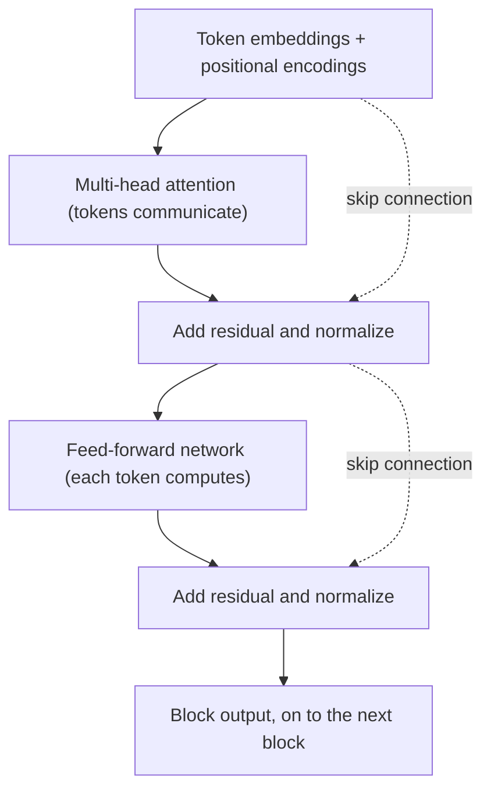

# Topic 14: Transformers

## Introduction

[Topic 13: Attention](topic-13-attention.md) left an engine running on a stand. The attention mechanism can let every token fetch relevant content from every other token, in parallel, using nothing but the dot-product geometry of [Topic 11: Embeddings](topic-11-embeddings.md). But an engine is not a vehicle. On its own, attention has no idea what order the tokens arrived in, no depth with which to build layered understanding, and no machinery to digest what it fetches. Stack naive copies of it and you inherit the old curse from [Topic 12: Sequence Models](topic-12-sequence-models.md): deep towers of computation where gradients die on the way down.

The second contribution of the 2017 paper *Attention Is All You Need* was the chassis. Take the attention layer, pair it with a small neural network, wire the pair together with two stabilizing tricks that make depth survivable, inject order information into the embeddings, and repeat the resulting block dozens of times. The assembled architecture is the **transformer**, and it is the single most consequential design in modern AI. Every system discussed for the rest of this chapter, and most of the systems making headlines since 2017, is a transformer under the hood: the "T" in ChatGPT stands for exactly this.

This topic is the architectural tour: what the parts are, why each one is there, and what the assembled whole can do. As throughout the chapter, the treatment is recognition-depth. The full engineering detail, and the experience of building one, lives in [Chapter 9: Transformers and LLMs](../chapter-09-transformers-and-llms/).

## Core Concepts

### The Transformer Block: Attend, Then Think

The repeating unit of the architecture is the **transformer block**, and its rhythm is worth memorizing as a two-beat phrase: *attend, then think*.

The first beat is the multi-head attention layer from [Topic 13: Attention](topic-13-attention.md). Every token looks across the sequence and gathers a blend of relevant content: the pronoun fetches its referent, the verb fetches its subject, each head collecting its own notion of relevance.

The second beat is a **feed-forward network**: a small, ordinary neural network of the kind built in [Topic 08: Deep Learning](topic-08-deep-learning.md), applied to each token's vector independently. If attention is the step where tokens *communicate*, the feed-forward network is the step where each token *processes* what it just heard, transforming the gathered context into a richer representation. Communication, then computation. Gather, then digest.

One block performs this two-beat cycle once. The full architecture stacks the block many times: 12 blocks in the earliest GPT models, 96 or more in the largest modern ones. Each pass deepens the representation, for reasons the stacking section below makes precise.

### Positional Encoding: Teaching an Order-Blind Mechanism About Order

Topic 13's Think About It posed the puzzle: self-attention treats the sequence as an unordered set, yet "dog bites man" and "man bites dog" must come out different. If you guessed that the fix involves adding order information to each token's embedding, you guessed the actual solution.

Before the first block runs, every token's embedding is combined with a **positional encoding**: a vector that encodes *where in the sequence* the token sits. Position 1 gets one pattern, position 2 a slightly different one, and so on. The original paper used fixed sinusoidal patterns; later models learn the position vectors or encode *relative* position inside the attention computation itself. The differences matter to practitioners, but the recognition-depth point is the same for all of them: after this step, a token's vector says both *what* the token is and *where* it is, and attention scores can now depend on order. "Dog" at position 1 and "dog" at position 3 are no longer the same vector, and the tie is broken.

### Residuals and Normalization: Making the Tower Trainable

Stacking dozens of blocks resurrects the oldest ghost in this chapter. [Topic 09: Backpropagation](topic-09-backpropagation.md) showed that blame flows backward through every layer it must cross, and [Topic 12: Sequence Models](topic-12-sequence-models.md) showed what happens when the crossing is long: multiplied link by link, the signal vanishes. A 96-block transformer is a 96-story building for gradients to fall down. Two standard tricks, used in every block, keep the tower trainable.

A **residual connection** (or skip connection) routes each layer's *input* around the layer and adds it to the layer's *output*. Instead of each layer producing a wholly new representation, it produces an *adjustment* to the running one. The consequence for training is decisive: the identity path gives gradients an unobstructed highway from the loss all the way down to the first block, so blame no longer has to survive multiplication through every layer to reach the bottom. Depth stops being fatal.

**Layer normalization** rescales the vectors flowing through each block to a standard, well-behaved range. Recall from [Topic 13: Attention](topic-13-attention.md) that oversized values push softmax into extreme regions where gradients die; normalization is the general-purpose guard against runaway or collapsing magnitudes anywhere in the stack, keeping every layer's numbers in the zone where learning works.

Neither trick is transformer-specific (both were developed for the deep networks of [Topic 08: Deep Learning](topic-08-deep-learning.md)), but the transformer uses them in every single block, twice per block, and would be untrainable without them.

### Stacking: Depth Builds Abstraction

Why repeat the block at all? Because each attend-and-think cycle can only combine information one hop at a time, and understanding is built from many hops.

In the first block, a token can gather from raw neighbors: "it" fetches "animal," an adjective finds its noun. By the second block, tokens are attending to representations that *already contain* those first-hop combinations, so second-order structure becomes reachable: phrases, agreements, references across clauses. Layer by layer, the representations climb from surface grammar toward meaning, discourse, and world knowledge.

This is the same story told in [Topic 08: Deep Learning](topic-08-deep-learning.md), where vision networks spontaneously organized into edges, then textures, then parts, then objects. Nobody assigns the transformer's layers their jobs either; interpretability research consistently finds early layers busy with syntax and position, middle layers with semantic relationships, and later layers with task-specific and factual structure. Depth is where abstraction comes from, and the transformer finally made extreme depth trainable on sequence data.

### Three Branches: Encoder, Decoder, Decoder-Only

The 2017 original was built for translation and had two towers: an **encoder** that reads the full input sentence (every token attending to every other, both directions) and a **decoder** that writes the output one token at a time, attending back to the encoder's reading. The two towers were soon split apart, and the family divided into three branches.

**Encoder-only** models (BERT, 2018, is the landmark) keep just the reading tower. Every token sees the whole sequence in both directions, which makes these models excellent at *understanding* tasks: classification, search relevance, extracting answers from a passage. They read; they do not generate.

**Decoder-only** models (the GPT line) keep just the writing tower. Their defining constraint is **causal masking**: inside attention, every token is forbidden from attending to positions *after* itself. Each token sees only its past. That restriction sounds like a handicap, but it is precisely what makes generation coherent and training efficient: the model learns to predict each token from its predecessors, and every position in every training sequence becomes a small prediction exercise, all computed in one parallel pass.

**Encoder-decoder** models (T5, and translation systems generally) keep both towers for tasks with a clear input-to-output shape.

The branch that conquered the field is decoder-only. It turned out that "predict the next token, at scale" is not one task among many but a master key to most of them, and that story is precisely where this chapter goes next in [Topic 15: Large Language Models](topic-15-large-language-models.md).

## Why It Matters

Before 2017, AI was a museum of task-specific architectures: convolutional networks for images, recurrent networks for sequences, bespoke designs for speech, for proteins, for recommendations, each with its own community, tricks, and folklore. The transformer ended that era. It is the closest thing the field has ever had to a universal architecture: one design, dialed to different sizes and fed different data, now dominates language, vision, audio, code, and biology. When practitioners today say "a model," a transformer is the default assumption.

The unification matters practically, not just aesthetically. A single dominant architecture means hardware, software libraries, and research effort all compound on one target. GPUs and their successors are now designed around transformer workloads; the optimizations, scaling recipes, and hard-won training folklore transfer across every domain the architecture touches. Progress anywhere becomes progress everywhere.

And the transformer is the reason *scale* became the central plot of modern AI. Because attention parallelizes and residuals make depth trainable, the architecture kept absorbing more data and more parameters without breaking, in a way no predecessor could. That absorption capacity is the precondition for everything in [Topic 15: Large Language Models](topic-15-large-language-models.md): the discovery of what happens when you make one of these towers very, very large.

## Real-World Examples

**BERT in your search results.** Encoder-only transformers have ranked and interpreted web search queries at major search engines since around 2019. When a search engine understands that "can you get medicine for someone pharmacy" is asking about picking up a prescription for another person, that reading comprehension is a bidirectional transformer at work.

**The GPT line and every modern chat assistant.** GPT stands for Generative Pretrained Transformer, and the decoder-only branch powers essentially every mainstream conversational model, including the one you are reading this curriculum with. Each reply is a causal-masked transformer predicting one token at a time.

**Vision Transformers.** Split an image into a grid of patches, embed each patch as if it were a token, add positional encodings, and feed the sequence to a standard transformer: the resulting Vision Transformer (ViT, 2020) matched and then surpassed convolutional networks on image recognition, confirming that the architecture is not a language trick.

**AlphaFold.** DeepMind's protein structure breakthrough runs on attention-based architecture: residues in a protein sequence attend to each other the way words in a sentence do, and the model infers which distant residues end up adjacent in the folded 3D structure. A biology revolution, on the same chassis.

## How It's Built

Recognition-depth means being able to trace one token's journey through the machine. Here is the full data flow.

Text is tokenized ([Topic 10: Tokenization](topic-10-tokenization.md)) and each token becomes an embedding vector ([Topic 11: Embeddings](topic-11-embeddings.md)). Positional encodings are added, so each vector now carries content plus location. The sequence then enters the first block:

The block's output feeds the next identical block, and the cycle repeats through the whole stack. After the final block, each position holds a deeply contextualized vector; a last learned transformation maps it onto a score for every token in the vocabulary, and a softmax turns the scores into the probability distribution of [Topic 06: Probability as Output](topic-06-probability-as-output.md). In a decoder-only model, that distribution is the model's prediction for the next token.

Two structural facts are worth carrying forward. First, the parameter count lives mostly in the *feed-forward* layers, typically about two thirds of a model's weights, with attention holding the rest; when [Topic 15: Large Language Models](topic-15-large-language-models.md) talks about where a model's knowledge is stored, those feed-forward weights are the leading suspects. Second, everything in the tower is built from the same primitives this chapter has already covered: matrix multiplications, softmaxes, and simple nonlinearities, trained end to end by [Topic 07: Gradient Descent](topic-07-gradient-descent.md) with gradients delivered by [Topic 09: Backpropagation](topic-09-backpropagation.md). There is no exotic ingredient. The magic, such as it is, is arrangement and scale.

## Key Takeaways

* The transformer is the architecture built *around* the attention mechanism of [Topic 13: Attention](topic-13-attention.md): the repeating **block** is attention (tokens communicate) followed by a **feed-forward network** (tokens compute), stacked dozens of times.
* **Positional encodings** solve attention's order-blindness by adding location information to each embedding before the first block, resolving the puzzle posed in Topic 13.
* **Residual connections** and **layer normalization** are the two tricks that make a very deep stack trainable, giving gradients a highway past every layer and keeping values in the range where learning works.
* Depth builds abstraction: early blocks handle surface grammar, later blocks semantics and knowledge, the same emergent hierarchy seen in [Topic 08: Deep Learning](topic-08-deep-learning.md).
* The family has three branches: **encoder-only** (BERT, understanding), **decoder-only** (GPT, generation with **causal masking**), and **encoder-decoder** (translation-shaped tasks). Decoder-only won the modern era.
* One architecture now spans language, vision, audio, code, and biology, ending the age of task-specific designs and making scale the central story, which is exactly where [Topic 15: Large Language Models](topic-15-large-language-models.md) picks up.

## References

* **3Blue1Brown**: *Transformers, the tech behind LLMs*, the visual tour of the full architecture; watch it after this topic and the block diagram will move.
* **Jay Alammar**: *The Illustrated Transformer*, the classic annotated walkthrough; the best second angle, with every sub-step drawn.
* **Vaswani et al.**: *Attention Is All You Need* (2017), the original paper; the architecture figure on its third page is the ancestor of every diagram in this topic.
* **Alammar and Grootendorst, *Hands-On Large Language Models***: chapters on the transformer connect the architecture forward to production language models.
* **Raschka, *Build a Large Language Model (From Scratch)***: implements this entire topic in code, block by block; it is the companion text for [Chapter 9: Transformers and LLMs](../chapter-09-transformers-and-llms/).

## Think About It

1. Residual connections mean each block computes an *adjustment* to a running representation rather than replacing it. Explain, using the link-by-link blame multiplication from [Topic 09: Backpropagation](topic-09-backpropagation.md), why the "adjustment" framing gives gradients a path that depth cannot destroy.
2. Causal masking forbids a token from attending to its future during training. During *generation*, the future does not exist yet, so the mask changes nothing. What does this symmetry between training and generation buy? Consider what would go wrong if a model trained with bidirectional attention were asked to generate text left to right.
3. Parameter counts concentrate in the feed-forward layers, and interpretability work suggests factual knowledge concentrates there too. If that is true, predict one thing that should be *hard* about updating a single fact inside a trained model (say, a new head of state), and check your intuition against [Topic 16: Pretraining vs Finetuning](topic-16-pretraining-vs-finetuning.md).

## Next Topic

The transformer is a machine that gets better the bigger you build it, and around 2019 a handful of labs decided to test how far that holds. Take the decoder-only branch, grow it by factors of ten, and train it on one deceptively humble task, predicting the next token, over a meaningful fraction of the written internet. What emerged was not just a better autocomplete but a new kind of artifact: models that translate, code, reason, and converse without being explicitly trained to do any of it. That artifact, and the scaling story behind it, is **[Topic 15: Large Language Models](topic-15-large-language-models.md)**.
