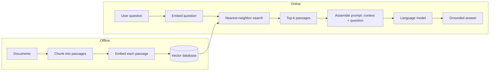

# Topic 21: RAG

## Introduction

[Topic 20: Prompting and Context Windows](topic-20-prompting-and-context-windows.md) ended on a wall built from two bricks. The first brick is that a model's knowledge is frozen at the moment pretraining ended; ask it about a document written yesterday or an event that happened after its cutoff, and it has nothing to draw on but confident guesswork. The second brick is that the context window is finite; you cannot simply paste an entire library into the prompt and let the model sort it out, because the library will not fit, and even the parts that fit may sit in the dead middle where the model barely attends.

The tempting move is to make the window bigger or to retrain the model on fresh data. Both are expensive, and neither scales. A window large enough to hold every document you might ever ask about would be astronomically costly to run, and retraining a model every time a fact changes is like reprinting an encyclopedia to correct a single date.

Retrieval-Augmented Generation, almost always shortened to **RAG**, is the move that sidesteps both problems. Instead of stuffing everything into the prompt or baking everything into the weights, you keep your knowledge in an external store, and at question time you fetch only the handful of passages that actually bear on the question and slip them into the context. The model then answers using those passages as if they had been part of the prompt all along. The window stops being a wall and becomes a doorway: narrow, but wide enough for exactly what you need, exactly when you need it.

As throughout the chapter, the treatment is recognition-depth. The full engineering, embedding pipelines, vector databases, chunking strategies, and reranking, lives in the dedicated retrieval chapter later in the curriculum.

## Core Concepts

### The Core Idea: Fetch, Then Generate

RAG splits the work of answering into two stages that the name spells out in reverse. First comes **retrieval**: given the user's question, find the most relevant pieces of text from an external collection. Then comes **augmented generation**: take those retrieved pieces, place them into the prompt alongside the question, and let the model generate its answer conditioned on them.

The shift is subtle but total. Without RAG, the model answers from what its weights happen to encode, a fixed and frozen store. With RAG, the model answers from what you just handed it, a live and swappable store. The weights supply the language ability, the reasoning, the fluency; the retrieved passages supply the facts. This division of labor is the whole point. You get a model that can speak and reason about information it was never trained on.

### Why Keyword Search Is Not Enough

The naive way to retrieve relevant text is keyword matching: the user asks about "car maintenance costs," so you search your documents for those words. This breaks immediately. A document that discusses "vehicle upkeep expenses" is exactly what the user wants, yet it shares not a single keyword with the query. Meaning and wording come apart, and keyword search only sees the wording.

The fix comes straight from [Topic 11: Embeddings](topic-11-embeddings.md). Recall that an embedding turns a piece of text into a vector, positioned in a space where similar meanings sit close together. If you embed every passage in your collection ahead of time, and then embed the user's question the same way, "relevant" becomes a geometric question: which passage vectors sit nearest the question vector? "Vehicle upkeep expenses" lands near "car maintenance costs" in that space even with no shared words, because the embedding captures meaning rather than surface form. This is **semantic search**, and it is the engine underneath most RAG systems.

### The Retrieval Pipeline

Putting it together, a RAG system has an offline phase and an online phase.

The offline phase happens once, ahead of any question. You take your documents, split them into passages small enough to be useful (a paragraph, a section), embed each passage into a vector, and store those vectors in a specialized database built to find nearest neighbors quickly. This store is often called a **vector database**, and the collection of embedded passages is the knowledge base.

The online phase happens on every question. The user's query is embedded with the same model, the vector database returns the handful of passages whose vectors sit closest to the query vector, and those passages are pasted into the prompt above the question, usually with an instruction like "answer using the following context." The assembled prompt goes to the model, which generates its response conditioned on the retrieved passages. The model never sees your whole collection, only the few pieces retrieval judged relevant.

### Grounding and Its Limits

The most valuable property RAG buys is **grounding**: the answer is tied to specific retrieved text rather than to the model's diffuse, sometimes unreliable internal memory. A grounded system can cite its sources, because it knows exactly which passages it was handed. This directly attacks the hallucination problem, the model's tendency to state fluent falsehoods, by giving it real text to lean on instead of forcing it to reconstruct facts from weights.

But grounding is only as good as retrieval. If the retriever fetches the wrong passages, or misses the one passage that held the answer, the model generates confidently from irrelevant context and the grounding is an illusion. RAG does not make a model truthful; it makes a model's answer conditional on whatever retrieval surfaced. Garbage retrieved is garbage generated. The quality of a RAG system lives and dies in the retrieval stage, which is why so much engineering effort goes there.

## Why It Matters

RAG is the technique that turned frozen, general-purpose language models into practical tools for specific bodies of knowledge. Every "chat with your documents" product, every customer-support bot that answers from a company's own help articles, every legal or medical assistant that reasons over a private corpus, is a RAG system underneath. It is arguably the single most deployed pattern in applied AI, because it solves the two problems that otherwise make a raw model useless in production: it cannot know your private data, and it cannot know anything recent.

It matters for a second reason: cost and control. Updating a RAG system's knowledge means editing the document store, not retraining a model. Add a new policy document and the system can answer about it minutes later. Remove an outdated one and the system stops citing it. This makes knowledge a data problem rather than a training problem, which is dramatically cheaper, faster, and more auditable. When a RAG system gives a wrong answer, you can often trace it to a specific retrieved passage and fix the source, a kind of debuggability that a monolithic model's weights simply do not offer.

## Real-World Examples

**Customer support over a help center.** A company has hundreds of support articles. A user asks a question in plain language, the system retrieves the three or four articles most relevant to it, and the model composes a direct answer from them, often linking the sources. The company never fine-tuned a model on its articles; it embedded them and let retrieval do the matching.

**Answering about recent events.** A model whose training ended last year knows nothing about a product released last week. Wire it to a store of current documents, and it answers about the new product accurately, not because its weights changed, but because the relevant page was retrieved and placed in its context.

**Internal knowledge assistants.** A large organization has years of internal wikis, policies, and reports, far more than any context window could hold and far too sensitive to send off for training. A RAG assistant embeds all of it into a private vector store and answers employee questions by retrieving the relevant internal passages, keeping the data in-house while making it queryable in natural language.

## How It's Built

Under the hood, the offline indexing phase runs each document through a chunker that splits it into passages, then through the embedding model from [Topic 11: Embeddings](topic-11-embeddings.md), producing one vector per chunk. Those vectors, along with the original text they came from, are written into a vector database that supports fast nearest-neighbor search, so that finding the closest vectors to a query does not require comparing against every entry one by one.

At query time, the user's question is embedded by the same model into a single vector. The database returns the top matching chunks, ranked by vector similarity, typically cosine similarity in the embedding space. Those chunks are concatenated into a context block, wrapped with an instruction telling the model to answer using them, and prepended to the user's question. The assembled prompt is measured against the context window from [Topic 20: Prompting and Context Windows](topic-20-prompting-and-context-windows.md), then fed to the model, which runs a single forward pass and generates the answer conditioned on both the retrieved context and the question.

The engineering subtleties, how large to make each chunk, how many to retrieve, whether to rerank the retrieved set with a second, more careful model, how to handle passages that fit the window's edges better than its middle, are where real RAG systems earn their quality. Those decisions belong to the dedicated retrieval chapter. At recognition depth, the shape is enough: embed once, retrieve on demand, generate grounded.

## Key Takeaways

* **RAG** separates knowledge from language ability. The weights supply fluency and reasoning; an external, swappable store supplies the facts, retrieved fresh at question time.
* It solves the two limits from [Topic 20: Prompting and Context Windows](topic-20-prompting-and-context-windows.md): a model's frozen knowledge and its finite window. Instead of retraining or enlarging the window, you fetch only the relevant passages on demand.
* Retrieval runs on **semantic search**, built on the embeddings of [Topic 11: Embeddings](topic-11-embeddings.md): the question and every passage become vectors, and relevance is nearness in that space, so meaning matches even when words do not.
* A RAG system has an **offline phase** (chunk, embed, store) that runs once, and an **online phase** (embed query, retrieve, assemble, generate) that runs per question.
* The payoff is **grounding**: answers are tied to specific retrieved text, which can be cited and which curbs hallucination. But grounding is only as good as retrieval; the wrong passages produce confident wrong answers.
* Updating knowledge becomes a **data problem, not a training problem**: edit the store, not the weights. This makes RAG cheap to update, auditable, and the most widely deployed pattern in applied AI.

## References

* **Lewis et al.**: *Retrieval-Augmented Generation for Knowledge-Intensive NLP Tasks* (2020), the paper that introduced RAG and gave the technique its name.
* **Karpukhin et al.**: *Dense Passage Retrieval for Open-Domain Question Answering* (2020), which established embedding-based dense retrieval as a strong alternative to keyword search.
* **Alammar and Grootendorst**: *Hands-On Large Language Models* (2024), for an accessible, implementation-oriented treatment of retrieval and RAG pipelines.
* **Anthropic**: *Retrieval-Augmented Generation* (documentation), a practical reference for structuring context and retrieval in production systems.

## Think About It

1. A RAG system and a fine-tuned model both let a language model "know" about a private corpus, but they do it in fundamentally different ways. Using the split between weights and retrieved context, explain what each approach actually changes, and give one situation where RAG is clearly the better choice and one where fine-tuning is.
2. A user asks a question, the RAG system confidently returns a wrong answer, and you trace the problem to the retrieval stage rather than the model. Explain how retrieval can fail even when the correct answer exists somewhere in the document store, and connect this to why "garbage retrieved is garbage generated."
3. Keyword search would have failed on the query "vehicle upkeep expenses" against a document about "car maintenance costs," but semantic search succeeds. Using the geometry of [Topic 11: Embeddings](topic-11-embeddings.md), explain why the two phrasings end up near each other in embedding space, and what property of the embedding model makes this possible.

## Next Topic

RAG lets a model pull in knowledge it lacks, but knowledge is not the only thing a model lacks. It cannot check today's weather, run a calculation it might get wrong, query a live database, or take any action in the world; it can only generate text. Retrieval fetches information into the prompt, but what if the model could instead ask an external system to *do* something and hand back the result? That capability, letting a model call out to real functions and use what they return, is the subject of **[Topic 22: Tool Use and Function Calling](topic-22-tool-use-and-function-calling.md)**.
