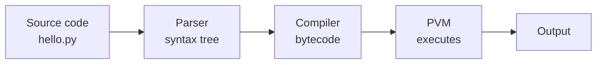

# Topic 03: Program Structure and Execution

In Topic 02: Environment Setup you ran a Python file and it printed a greeting. It worked, but it worked as magic: you typed `uv run python hello.py`, something happened inside the machine, and text appeared. This topic replaces the magic with a model. What is a Python program made of, and what does the interpreter actually do with it when you press Enter?

Having that model early pays off for the rest of the chapter. Error messages stop being noise and start pointing at real stages of a real pipeline. Strange artifacts like `__pycache__` folders stop being mysterious clutter. And a handful of Python's most distinctive design choices, indentation as syntax chief among them, turn out to be deliberate decisions you can reason about rather than quirks to memorize.

## From Source to Running Program

A Python program starts life as a plain text file with a `.py` extension. Nothing more: no project file is required, no compilation step is visible, no binary is produced next to it. This simplicity is real but slightly deceptive, because between your text and the CPU there is a pipeline with distinct stages.

When you run `uv run python hello.py`, the interpreter does the following:

1. **Reads and parses the source.** The text is tokenized and parsed into a syntax tree. This is where syntax errors are caught: a missing colon or an unclosed bracket stops the program here, before a single line has executed.
2. **Compiles to bytecode.** The syntax tree is compiled into **bytecode**: compact, low-level instructions for a machine that does not physically exist. Python is compiled after all, just not to CPU instructions.
3. **Executes on the Python Virtual Machine.** The **PVM** (Python Virtual Machine) is a loop inside the interpreter that reads bytecode instructions one at a time and carries them out. This is the "interpreted" part of Python, and it is where your program actually runs, and where runtime errors like dividing by zero surface.



So the honest description of CPython (the standard interpreter you installed in Topic 02: Environment Setup) is not "interpreted" but "compiled to bytecode, then interpreted." If you are coming from Rust, the contrast is where the pipeline stops: `rustc` continues all the way down to native machine code ahead of time, while Python stops at bytecode and executes it in software at run time. That difference is the root of both Python's flexibility and its relative slowness, a trade-off Topic 25: Memory and Performance examines in depth.

The bytecode stage leaves visible traces. When one file imports another, Python caches the imported file's compiled bytecode on disk so it does not have to recompile it next time. That cache is the `__pycache__` folder, full of `.pyc` files, that appears in nearly every real Python repository. It is disposable, safely deletable, and belongs in `.gitignore`; Python regenerates it whenever the source changes.

## Statements and Expressions

Zoom in from the pipeline to the code itself. A Python program is a sequence of **statements**, and many statements contain **expressions**. The distinction sounds academic but you will use it every day:

- An **expression** is anything that evaluates to a value: `2 + 2`, `"a" * 3`, `len(name)`.
- A **statement** is a complete instruction: an assignment like `x = 2 + 2`, an `import`, a `for` loop, a function definition.

Every expression can stand alone as a statement, but not the reverse: `x = 5` produces no value, it performs an action. The REPL from Topic 02: Environment Setup makes the difference visible. Type an expression and the REPL prints its value back; type a statement and it prints nothing:

```python
>>> 2 + 2        # expression: REPL shows the value
4
>>> x = 2 + 2    # statement: nothing shown, but x now exists
>>> x            # the name x is itself an expression
4
```

One statement per line is the norm. Python does allow a semicolon to join statements on one line, but idiomatic Python essentially never uses it; the newline is the statement terminator, and this is your first taste of a theme that recurs all chapter: Python's syntax is designed so that code reads like its own description.

## Indentation Is Syntax

Here is the design choice everyone notices first. In most languages, blocks of code are wrapped in delimiters (braces in Rust, C, and JavaScript) and whitespace is cosmetic. In Python, **indentation is the block delimiter**. A colon at the end of a line announces that a block follows, and everything indented beneath it belongs to that block:

```python
temperature = 30

if temperature > 25:
    print("It is hot")        # inside the if block
    print("Drink water")      # still inside
print("Done checking")        # outside: always runs
```

There are no braces to match and no `end` keyword. The visual structure *is* the logical structure, which means the two can never disagree. In brace languages, code can be indented misleadingly while the braces say something else, a mismatch behind real bugs (Apple's famous `goto fail` SSL vulnerability was exactly this shape). Python makes that category of bug a syntax error instead.

The rules are strict but few:

- Blocks are introduced by a colon and consistent indentation. The universal convention is **4 spaces** per level.
- Never mix tabs and spaces; Python 3 refuses to run files that do. Your editor from Topic 02: Environment Setup inserts spaces automatically, so in practice this takes care of itself.
- Returning to a previous indentation level closes the block.

Get the indentation wrong and Python raises `IndentationError` at the parsing stage, before anything runs. Treat that error as a friend: it is the language refusing to guess what you meant.

## Comments and Docstrings

Two ways to write text for humans inside a file for machines:

```python
# A comment: from the # to the end of the line, Python ignores it.
radius = 5  # comments can share a line with code

def area(r):
    """Return the area of a circle with radius r."""
    return 3.14159 * r * r
```

The `#` comment is for notes to readers of the source. The triple-quoted string in the function is a **docstring**: documentation that is part of the program itself. Placed as the first statement of a file, function, or class, it is stored on the object and available at run time, which is what powers `help(area)` in the REPL and the tooltips your editor shows. The habit to build now: comments explain *why*, docstrings explain *what*, and code that needs a comment to explain *what it does* usually needs rewriting instead. Topic 09: Functions returns to docstring conventions properly.

## Scripts, Modules, and the Main Guard

The same `.py` file can serve two roles. Run directly (`uv run python analyzer.py`), it is a **script**: a program you execute. Imported from another file (`import analyzer`), it is a **module**: a library someone else's code uses. Python's import system, covered fully in Topic 16: Modules, Packages, and the Standard Library, has one behavior you must know today: **importing a file executes it**, top to bottom. Every statement runs, not just the definitions.

That creates a problem. Suppose `analyzer.py` defines useful functions and, at the bottom, runs a demonstration. Anyone who imports it to reuse the functions triggers the demonstration as a side effect. The universal solution is the **main guard**. Here is the entire content of a file named `analyzer.py`, and it is important to read it as one file containing **two separate parts**:

```python
# analyzer.py

# Part 1: the function definition.
# This is the library part. It is what importers come for.
def analyze(text):
    """Count the words in a piece of text."""
    return len(text.split())

# Part 2: the main guard block.
# This is the demo part. It runs only when the file is
# executed directly, never when the file is imported.
if __name__ == "__main__":
    sample = "the quick brown fox"
    print(analyze(sample))
```

To be precise about the pieces: the function `analyze` is only the `def` line and its indented body. The `if` block underneath is not part of the function; it is separate top-level code sitting in the same file, and it *calls* the function defined above it. No import is needed for that call, because imports are only for names defined in *other* files; within one file, a name defined higher up is simply available lower down, since files execute top to bottom.

Now the guard itself. Python sets a variable called `__name__` in every file as it runs it. In the file being executed directly, `__name__` is the string `"__main__"`; in a file that is merely imported, `__name__` is the module's own name (here, `"analyzer"`). So the two parts of the file behave differently depending on the role:

- Run directly (`uv run python analyzer.py`): part 1 executes and creates the function, then the guard condition is true, so part 2 runs the demo. Output: `4`.
- Imported (`import analyzer` from another file): part 1 executes and creates the function, but `__name__` is `"analyzer"`, the condition is false, and part 2 is skipped. The importer gets a clean library and no side effects.

This idiom appears in virtually every serious Python file, and now you know exactly why it works: it is a plain `if` statement over a variable the interpreter sets for you, not special syntax.

Professional Python goes one step further. Instead of putting logic directly inside the guard, it wraps the entry-point logic in a function conventionally named `main`, and the guard does nothing but call it:

```python
# analyzer.py

def analyze(text):
    """Count the words in a piece of text."""
    return len(text.split())

def main():
    sample = "the quick brown fox"
    print(analyze(sample))

if __name__ == "__main__":
    main()
```

The guard shrinks to two lines and never grows again. This buys three things that matter in real codebases:

- **Everything becomes importable and testable.** Test frameworks (Topic 20: Tooling, Testing, and Debugging) work by importing your file and calling its functions. With bare code in the guard, the entry-point logic cannot be tested; as `main()`, it is just another function a test can call.
- **No variables leak to the top level.** In the earlier version, `sample` was a module-level variable visible to the whole file. Inside `main()`, it is local and disappears when the function returns, which matters once files grow past toy size.
- **Safety with tools that re-import your file.** Some standard library machinery, notably `multiprocessing` on macOS and Windows, launches worker processes by re-importing the main file. Without a proper guard, each worker re-runs the launching code and the program spawns processes without end. This is a real crash you will meet, and the guard-plus-`main()` pattern is the fix.

Adopt the pattern now: every runnable SOCC file from this point on ends with a `main()` function and a two-line guard.

## Peeking at the Bytecode

The pipeline from the first section is not hidden; the standard library ships a module called `dis` (disassembler) that shows the bytecode for any function. Try it in the REPL:

```python
>>> def add(a, b):
...     return a + b
...
>>> import dis
>>> dis.dis(add)
  2           LOAD_FAST                0 (a)
              LOAD_FAST                1 (b)
              BINARY_OP                0 (+)
              RETURN_VALUE
```

(The exact instruction names vary slightly between Python versions; the shape is what matters.) Four instructions: load `a`, load `b`, add, return. This is what the PVM actually executes, and it is the concrete proof that "Python compiles your code" is not a metaphor. You will rarely need `dis` day to day, but knowing it exists changes how you read the language: every construct you learn from here on ultimately becomes a short sequence of instructions like these.

## Key Takeaways

- A Python program travels a pipeline: source text is parsed, compiled to **bytecode**, then executed by the **Python Virtual Machine**. Syntax errors stop the parse; runtime errors happen in the PVM.
- `__pycache__` folders hold cached bytecode from imports; they are disposable and belong in `.gitignore`.
- **Expressions** evaluate to values; **statements** are complete instructions. The REPL echoes expression values, which makes it a live laboratory for the distinction.
- **Indentation is syntax**: a colon opens a block, 4 spaces per level delimit it, and visual structure and logical structure can never disagree.
- Comments (`#`) explain why; **docstrings** (triple-quoted, first statement) document what, live on the object, and power `help()`.
- Importing a file executes it, so real files use the main guard: `if __name__ == "__main__":` separates run-as-program code from imported-as-library code.
- Professional files keep the guard to two lines that call a `main()` function; this makes the entry point testable, keeps variables local, and is required for `multiprocessing` safety.
- The `dis` module disassembles any function into the bytecode the PVM runs, turning the execution model from theory into something you can inspect.

## Think About It

Python could have compiled all the way to machine code, as Rust does, or skipped compilation entirely and interpreted the syntax tree directly. It chose the middle: compile to bytecode, interpret the bytecode. What does each design buy and cost? Consider startup time, portability across CPUs, how easy it is to build a REPL, and how much the language can let you change at run time. Then flip the question: given that bytecode exists anyway, why do you think Python shows it to you through `dis` instead of hiding it as an implementation detail?

## Next Topic

Topic 04: Variables and Core Types, where the values flowing through that pipeline get names, and Python's most consequential idea appears: every value is an object, and variables are just labels pointing at them.
